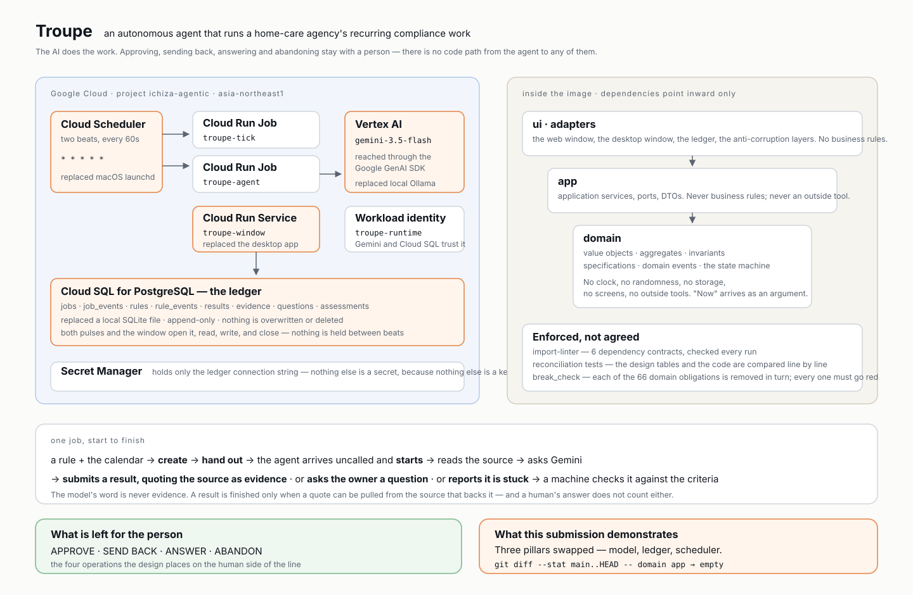

# Troupe（一座）

AI が仕事を回し、**判断は人間**が持つ仕事場——舞台は在宅医療の事業所。

指示書の期限が切れれば、その下の訪問は全部請求できなくなる。誰も忘れたくて忘れるのではない。小さくて、繰り返しで、その日の本業の下に沈むだけだ。一座はそれを見張り、仕事を進め、**人が決めるべき一点でぴたりと止まる**。

**いま Google Cloud で動いている:** https://troupe-window-834978405023.asia-northeast1.run.app

5分ごとの脈が2本、Cloud SQL の帳簿を打ち続けている（間隔は `cloud/deploy.sh` の1行。**設計は数を決めていない**——主張は「AI は呼ばれずに来る」であって、何分おきに来るかではない）。画面に出ているものは全部、エージェントが座長の判断のために置いたもの——手で並べたものは1つも無い。迷ったら**案内**に日本語で訊けばいい。「今日、私が要るのはどれ？」

## 仕事はこう回る

業務ルール×暦から時計が仕事を作って配り、AI が**呼ばれずに**取りに来る。源を読み、Gemini に問い、**根拠の引用を添えて**成果を出すか、分からなければ持ち主に尋ねるか、行き詰まりを見立てつきで報告する。機械が基準と突き合わせ、残った判断——**承認・差し戻し・回答・打ち切り、そして枕元では署名**——だけが人の前に出る。それは人しか押せない。

起きたことはすべて帳簿に出来事として積まれ、上書きも削除もされない。**履歴**を開けば、どの一手が人・AI・時計のどれだったか、印つきで全部読める。

## この提出が示すこと

> **LLM も帳簿も常駐も差し替えて、`domain/` と `app/` は1行も変わらなかった。**

| 柱 | 前 | 今 |
|---|---|---|
| 頭脳 | Ollama **Gemma 3 12B**（手元の Mac） | **Gemini 3.5 Flash**（Vertex AI） |
| 帳簿 | SQLite のファイル | **Cloud SQL for PostgreSQL** |
| 常駐 | macOS launchd | **Cloud Run Jobs + Cloud Scheduler** |
| 窓 | PySide6 のデスクトップ | **Cloud Run サービス**（上の URL） |

主張は自分の手で確かめられる:

```sh
git diff --stat baseline..pillars-swapped -- domain app   # 空
uv run lint-imports                                       # 6つの依存契約
```

`baseline` が差し替え前の最後の目印、`pillars-swapped` が完了の目印。設計は最初から「常駐も LLM を呼ぶ道具も汎用——買うもの」と言っていた。3本差し替えて中核が無傷だったことが、その境界が本物だった証拠になる。その後に足した機能（診療の環・署名の画面・案内）は `app/` を広げたが、そこでも順序は同じ——**先に設計の表を直し、突合テストを赤くしてから、コードで緑に戻す**。

## 診療録——第二のコンテキストと、書き込みの境界

一座の帳簿は診療録ではない。診療録は**よそのコンテキスト**——別のデータベースで、中身は全部合成。境界は設計に引かれ、コードが守る:

- **AI が読むのは署名済みの記録だけ。** 自分の未署名の下書きを自分の材料にはしない。
- **自動（脈）が診療録に書けるのは3つだけ**——承認済みの下書きを**下書き受け**に置くこと、**取り決め由来の予定**の展開、**署名済みの訪問からの算定の導出**。旗を裁く・請求を確定する口は無い。
- **署名済みは不変。** 署名の瞬間から、データベースのトリガが書き換えも削除も拒む。患者を作る口も、どこにも無い。

## 署名の環

取り決め（誰と・何曜・何週おき——**取り決めこそが人の判断**）を**定期訪問**に載せると、予定への展開は脈がやる——4週先まで、冪等に。**道順**がその日の訪問を担当ごとの回り順にする——地図と距離は本物、**患者宅の代役は公共の場所**（神社・駅・公園）。停留から**当日入力**を開けば、AI の下書きが S/O/A/P の初期値に入っている。医師が直して**署名**——**署名者は押した席そのもの**（医師の席だけが署名できる。別の名を選ぶ道は無い）。1つのトランザクションで記録が積まれ、訪問は実施済みになる。下書きには書かない——下書きは**その訪問（患者×日、一意）宛て**なので、使われたかは署名済みの記録の存在から導かれる。どの記録からも、その訪問宛ての下書きと、それを書いた AI の仕事まで辿れる。

そして**署名済みの記録が、翌週の下書きの材料になる**。環が閉じる。

## 案内は、指せるが押せない

**案内**のチャットは読む道具しか持たない。応対のサービスが受け取るのは読み手と LLM の口だけ——**型（signature）に書き込みの口が無いので、会話から実行へ届く道がコード上に存在しない**。答えに貼れるリンクも画面の白名単だけ。注入されても、押す指が無い。

## 審査中の代役——Sim-Director

審査のあいだだけ、台本の代役 **Sim-Director** が人のボタンを押している——**承認・署名・終わった月の請求の確定だけ**、2時間おき。隠していない: 人と同じ公開の画面を叩き、一押しごとに履歴へ自分の名で記録され、全ページに帯が出る。回答・差し戻し・打ち切りは決してやらない——**答える・差し戻す・旗の裁きなど本物の判断が要る操作は、本物の人を待つ**。受信箱で待っているのが見える。

**患者が合成なら、座長も合成**——どちらも、そうだと名乗る。データはすべて発明で、実在の医療情報はどこにも無く、AI にも渡らない。

## 動かす

クラウドは `sh cloud/deploy.sh` 一本で配線される（再実行しても安全）。`sh cloud/seed-emr.sh` が合成の診療録を、`sh cloud/status.sh` が脈の様子を出す。手元なら、クラウド無しで同じコードが動く:

```sh
uv run python main.py serve --viewer 座長   # 同じ窓を localhost で
```

`--llm ollama|gemini` で頭脳を、`--dsn` で帳簿を選ぶ。それ以外は何も変わらない。

## 確かめる

```sh
uv run pytest -q                    # 902本（＋21本は本物の Postgres が要る）
uv run pyright                      # domain・app は strict
uv run lint-imports                 # 依存は内向きのみ・ui は domain を知らない
uv run python tests/break_check.py  # 義務70個を1つずつ壊して、全部が赤くなるか
```

## 設計——5枚が正本

**まず [`設計/どう作るか.md`](設計/どう作るか.md) を読む**
——書式の掟と、前の一座がなぜ失敗したかが書いてある。

| | 文書 | 何が書いてあるか |
|---|---|---|
| 1 | [起きてはいけないこと](設計/起きてはいけないこと.md) | **設計全部の源**。守るべきもの |
| 2 | [仕事とは何か](設計/仕事とは何か.md) | ドメイン・中核・語・値オブジェクト・集約・不変条件・状態と遷移・型で殺す |
| 3 | [仕事が回る筋道](設計/仕事が回る筋道.md) | 誰が始めるか・判断のありか・ファクトリ・interface・ドメインイベント |
| 4 | [人に見えるもの](設計/人に見えるもの.md) | 画面・渡す値・押せること・今日に出す条件 |
| 5 | [どう作るか](設計/どう作るか.md) | 書式・層・フォルダ・赤くする仕掛け |

設計とコードは突合テストが繋いでいる——遷移表・出来事・値オブジェクト・操作表・interface 表は、
**設計の表を壊してもコードを壊しても赤くなる**。ずれたまま進めない。

5枚の英訳が [`design/`](design/) にある。**正本は `設計/`**——突合が読むのは和文だけなので、ずれたら和文が正しい。

## 配線の図



---

English README: [README.md](README.md) · ライセンス: [MIT](LICENSE)
