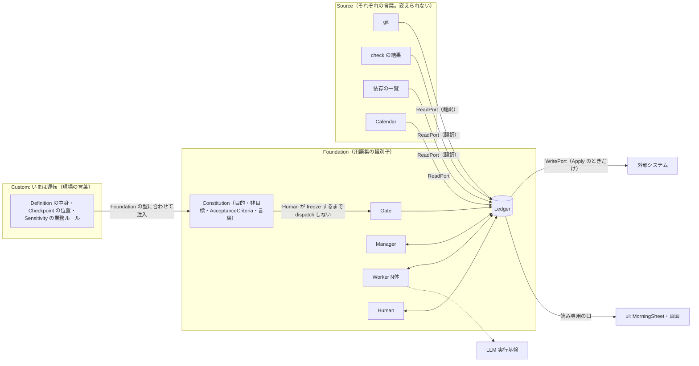

# Ichiza（一座）— コンテキストマップ

**版**: v2.3（2026-08-21。v2.3: 注入が現実になった（カスタムはファイル・注入は人の操作）。v2.2: v2.2: バックアップ先を外した——実在しない源だった（作り話が設計に入り込んでいた）。v2.0: v2.0: 術語を識別子に統一——読みかた 掟9）
**状態**: **有効になった**（2026-08-21、人が有効化した）

Boundary と、Boundary を跨ぐ口をすべて1枚に描く。**Boundary を跨ぐ言葉は必ず翻訳される**——それがこの図の唯一の主張。

---

## 1. 地図

---

Source の列は題材ごとに入れ替わる（庶務期にはメール、診療期にはカルテ・レセコン・支払基金が並ぶ）。**図の形は変わらない**——それがこの設計の約束。

## 2. Boundary を跨ぐ掟

1. **Source → Foundation は ReadPort だけ。** ReadPort が Source の言葉を Foundation の言葉に翻訳する。Source 1つに ReadPort 1つ。1つ落ちても他は回る
2. **Foundation → 外は WritePort だけ。** ReadPort と別物。使われるのは Apply のときだけ（Irreversible はここだけ）
3. **Custom → Foundation は注入だけ。** Foundation は型を差し出し、Custom が中身を注ぐ。Foundation は Custom の中身を1行も知らない。逆流なし。
   **形**: `custom/<題材>/` の TOML を `CustomPort` が読み、`inject`（人の操作）が帳簿へ入れる
4. **GUI は読み専用の口から。** 画面がドメインを直接触らない。書くときは Utterance として Ledger に落ち、Job が作成される
5. **LLM は Worker の中に閉じる。** Ledger は LLM を知らない。Manager も原則使わない（Reconciliation と日付演算だけ）

---

## 3. モデルの注入（未決#6への結論。ドメインモデル §6 に反映済み）

- **Constitution に「言葉」を含める。** Board の Constitution ＝ 目的・非目標・AcceptanceCriteria・**言葉**（現場の言葉の用語集）
- **Agent は起動時に、CapabilityDeclaration と一緒に Board の Constitution を読み込んで announce する。** 言葉の照合もここでやる——Constitution に無い語で書かれた Artifact は Review で差し戻せる
- これで入れ子が閉じる: Foundation の言葉はコードに焼き込まれ（用語集）、現場の言葉は Constitution として注入され、Source の言葉は ReadPort で翻訳される。**翻訳されない言葉はどこにも入って来られない**
