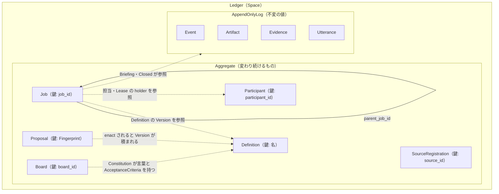

# Ichiza（一座）— 集約境界図

**版**: v2.3（2026-08-21。v2.3: §6 集約の仕立て——**新しい Job の持ち物が何から決まるか**を書ききり、**生成と再構成の区別**を足した。期限の決まり方（作成時刻＋deadline_days）は設計のどこにも無く、コードにだけ在った。v2.2: v2.2: Version に「適用が要るか」。v2.1: v2.1: Version の中身を明記——承認待ちの位置と必ず含む語）
**状態**: **有効になった**（2026-08-21、人が有効化した）

Boundary の引き方の原則: ①不変条件は Boundary の内側で守る ②Boundary は小さく ③他の Aggregate は ID で参照 ④Boundary の外は結果整合で。

---

## 1. 答え: Aggregate は6つ。Ledger は Aggregate ではなく Space

- **Ledger は Space**（計画の問いへの結論）。中身は「6つの Aggregate」と「AppendOnlyLog」
- **AppendOnlyLog**（Event・Artifact・Evidence・Utterance）は不変の値の追記なので、守る Boundary が要らない——壊れようがない。**Aggregate が要るのは、変わり続けるものだけ**（歩3の仕分けがそのまま効く）

## 2. 図

## 3. 各 Aggregate の中身と、内側で守る不変条件

| Aggregate（鍵） | 中身 | この Boundary の内側で守るもの（即時） |
|---|---|---|
| **Job**（job_id） | State・Origin・2つの時刻・Lease・Briefing（参照の束）・Budget・parent_job_id・担当の ID・Checkpoint の記録 | I2 担当した人しか approve できない／Lease の排他／Irreversible な Apply は Checkpoint 済みのみ／Budget 超えは Failure へ／合法な State 遷移だけ |
| **Definition**（名） | Version の列・いま有効な Version。**Version が持つもの**: 業務の指示・受け入れ基準・周期・期限までの日数・Budget・読むべき源・**必ず含む語**（Check が見る決定的な部分）・**承認待ちの位置**（無ければ承認済みへ直行）・**適用が要るか**（要らなければ承認済みから直に完了へ） | Version は積むだけ・上書き無し／enact するのは Human だけ |
| **Board**（board_id） | Constitution の Version の列・freeze の状態 | freeze するのは Human だけ／Constitution も Version を積むだけ |
| **Participant**（participant_id) | 登録・現在の CapabilityDeclaration・照合の結果 | 照合を通っていない Participant は「働ける」にならない |
| **Proposal**（Fingerprint） | 中身・状態（作成される→enact／却下） | **却下は再発しない**——Fingerprint が同一性だから、同じ中身を作り直しても同じ Proposal＝却下のまま |
| **SourceRegistration**（source_id） | ReadPort の契約の Version の列・**SensitivityMark** | 契約も Version を積むだけ。SensitivityMark は take で突合される |

## 4. Boundary の外は ID と結果整合

- **親子の Job**: 子が parent_job_id を持つ。**親は子の一覧を持たない**——一覧は Ledger に聞く（名指しの一覧より、宣言から導く）
- **Lease の取り合い**: Job の版で決着。先に書けた方が勝ち、負けた方は取り直す。落ちたら Lease の期限が切れて Job は Ready に戻る
- **Gate**: どの Aggregate の不変条件でもない——**dispatch の Check**。Manager が dispatch する前に Board の freeze を読む。freeze が解けた直後に通り抜けた1件は止めず、事故として記録して赤く見せる（`CheckpointBypassed` と同じ扱い）
- **announce と take**: take できるかは Participant の照合結果を ID で読んで確かめる（書くのは Job だけ）

## 5. 1回の書き込みは1つの Aggregate（確かめ）

| 操作 | 書く Aggregate |
|---|---|
| Job を create する（Reconciliation・Instruction・ChildJob） | Job（新規1つ） |
| take・release・expire／submit／approve／attempt_apply・record_outcome | Job |
| close（Evidence で） | Job（Evidence は AppendOnlyLog への追記——Aggregate ではない） |
| Version を append する／enact する | Definition |
| Constitution を append する／freeze する | Board |
| announce する（照合） | Participant |
| Proposal を create する／enact する／却下する | Proposal（enact の結果の Version は、次の書き込みとして Definition に積む——結果整合） |

2つの Aggregate を1回で書きたくなったら、まず Boundary を疑う。それでも要るなら Event を介して結果で揃える（歩5）。

> **Ledger の原子性**: Aggregate の書き込みと、その Event の追記は、**同じ Ledger への1回の書き込みで一緒に確定する**。
> 1台と1つの保存の利点であり、外に別の伝送の仕組みを作らない。

## 6. 集約の仕立て（新しい1件は何から決まるか）

**仕立ては「新しい1件が満たすべき形」**——業務の規則であって、回す手順ではない。
だから Aggregate ごとに、持ち物の出どころをここに書ききる。書ききれない持ち物があるなら、
それは Version か Constitution に欄が足りていない。

### Job の仕立て

| 持ち物 | 何から決まるか |
|---|---|
| job_id | **立てた者が、立てた瞬間に振る**（§4 の採番）。形は問わない——ID に意味を持たせない |
| origin | 業務ルールの名 × 有効な Version の番号 × いまの対象期間。**これが二度作成されない鍵** |
| board_id | その業務ルールが属する Board |
| ready_at | 作成した時刻。先に始めたければ Instruction で頼む（予定を前倒ししない） |
| deadline | **作成した時刻 ＋ Version の deadline_days**（2026-08-21 に明記。それまで設計のどこにも無く、コードにだけ在った） |
| budget | Version の Budget をそのまま写す。**写しであって参照ではない**——後から版が変わっても、このタスクは生まれた版の量で裁かれる |
| 初期状態 | `Created`。Briefing はまだ無い（解決するのは dispatch） |

**採番だけは仕立ての外**（立てた者が振る）。仕立ては振られた ID を受け取って形を組む——
こう割ると、「誰が立てたか」と「どんな形か」が別々に決められる。

### 生成と再構成は別の操作

**新しく作る（生成）**と**保存されたものを戻す（再構成）**は、まったく別の操作。
1つの入口で兼ねると、必ずどちらかが歪む。

| | 生成 | 再構成 |
|---|---|---|
| いつ | 新しい1件が生まれるとき | 帳簿から読み戻すとき |
| 業務の規則 | **効かせる**（上の表が規則そのもの） | **効かせてはいけない** |
| 初期状態 | `Created` から始まる（規則） | 保存されていた状態をそのまま受け取る |

**再構成に今の規則を効かせると、過去の行が読めなくなる。**
帳簿は積むだけで、道具より長生きする——きのう書いた行を、きょうの規則で弾いてはいけない。
規則が変わったら、変わったあとに生まれる1件から効かせる（タスクは生まれた版で裁かれる、と同じ形）。

**いまはこの区別が無い**（2026-08-21 に判った）。帳簿から戻す道は1つしかなく、
そこに今の型の検査が丸ごと効いている。欄を1つ足したら、その瞬間から古い行が読めなくなる。

### 仕立てが要らない Aggregate

`Definition`・`Board`・`SourceRegistration` は**人が書いたデータから翻訳して生まれる**ので、
仕立てではなく翻訳（注入）が形を決める。`Participant` は起動時の照合が形を決める。
`Proposal` は Fingerprint が同一性なので、中身から鍵が決まる——仕立てが要るのは Job だけ。

