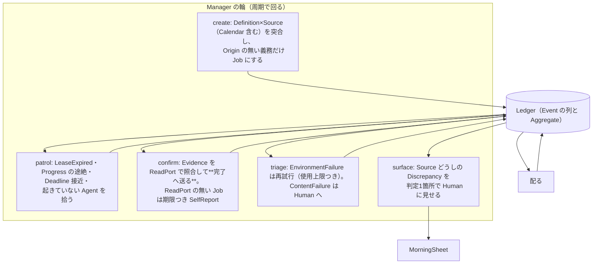

# Ichiza（一座）— 調停図

**版**: v2.3（2026-08-21。v2.3: dispatch を輪の一覧に（設計の漏れ）。confirm が完了へ送ることを明記。v2.2: v2.2: 輪自身が落ちたときを追加。v2.1: v2.1: 検証の輪（verify）を6つ目として明記——実装して判った欠け）
**状態**: **有効になった**（2026-08-21、人が有効化した）

Manager の回す輪。**全部が Reconciliation と日付演算——判断も LLM も無い。** そして**全部の輪が冪等**——何度回しても同じ結果になる（回し直しが怖くない＝I8 の土台）。

---

## 1. 7つの輪

## 2. 各輪の冪等の鍵

| 輪 | 冪等の鍵 |
|---|---|
| `dispatch` | 作成済みのタスクだけを配る。既に未着手のものは触らない |
| `create` | **Origin**——同じ Origin の Job はもう在るか、を先に確かめる。二重に作成されない |
| `patrol` | State を読んでから書く。切れていない Lease は切らない。既に戻した Job は戻さない |
| `confirm` | Evidence の Fingerprint——同じ Evidence の照合を繰り返しても結果は同じ |
| `triage` | 再試行の回数は Job が持つ（Budget）。数え直しは起きない |
| `surface` | Discrepancy は対の Fingerprint で1件。同じ Discrepancy を二度並べない（狼少年を作らない） |

## 3. 輪自身が落ちたとき

輪も落ちる（帳簿が塞がっている・材料が壊れている・思わぬ形の値）。そのときの掟:

1. **1つの輪の失敗で、他の輪を止めない**——輪ごとに捕まえる。1周飛ばして次へ（I8「動き続ける」）
2. **落ちた事実は帳簿に落とす**（FailureOccurred。どの輪か・理由を載せる）。
   **画面の外（標準エラー出力）に消さない**——出口は1本、そこに無いものは無いことになる
3. **帳簿への書き込み自体が落ちたときだけ**、最後の砦として標準エラー出力へ。
   ここだけは「消える」を許す——他に書く場所が無いから
4. 輪は次の周で必ずやり直す。**全部の輪が冪等だから、やり直しは安全**

## 4. 掟の確かめ

- どの輪も**書くのは1回に1 Aggregate**（＋AppendOnlyLog への追記）
- どの輪も判断しない: create するのは Definition の写し、戻すのは Lease の期限、上げるのは Failure の種別——すべて機械の判定
- **`dispatch`（配る）は輪の1つ**（2026-08-21 に一覧へ追記。実装が先にあった漏れ）:
  方針が凍結されたボードの、作成済みのタスクに作業情報を詰めて未着手へ。関門はここが見る
- **`confirm`（確かめる）が完了へ送る**——タスクを閉じるのは働き手でも人でもなく、
  証拠を照合したマネージャー。**証拠で閉じる**（人の報告に頼らない）が形になる場所
- **`verify`（検証する）は6つ目の輪**（2026-08-21 追加。実装して判った欠け）: Verifying の Job に Check をかけ、
  通れば承認待ちか承認済みへ、止めれば未着手へ戻す。Check は決定的なので Manager の機械仕事——**判断ではない**。
  Review（LLM の点検）は働き手の仕事なので、この輪には入らない
- Human に出る口は **MorningSheet だけ**（Alert の出口は1本）
