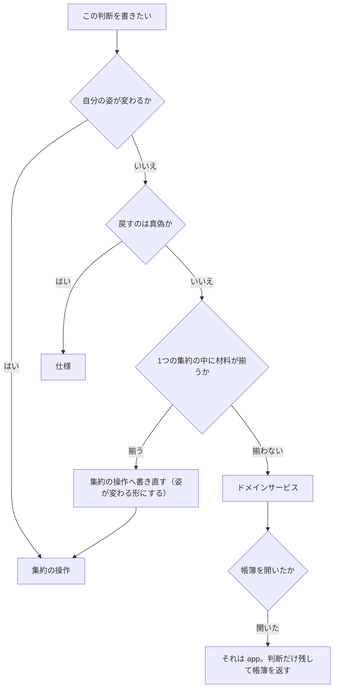

# Ichiza（一座）— ドメインサービスと仕様

**版**: v1.0（2026-08-21）
**役目**: **どの集約にも入らない業務の判断**を置く場所を決め、仕様（Specification）とポリシーに分ける。

---

## 0. 先に3つ断る

**1. ここに並ぶものは全部 domain 層に住む。帳簿を開かない・書かない。**
開いて・渡して・しまうのは[アプリケーションサービス](アプリケーションサービス.md)。
ドメインサービスと仕様は**材料を受け取って判定を返すだけ**。返した判定を帳簿へ書くのは app。
なぜ——書き込みの範囲を決められるのは app だけ（Repository は1回の保存しか知らない）。

**ただし `gather_today` だけは帳簿に書かない。出口は画面**
（[アプリケーションサービス §3](アプリケーションサービス.md)）。
書かないものは抜けても何も止まらないので、**執行者を必ず置く**。

**2. 「検査 `Check`」は業務の検査。自動試験のことではない。**
成果が受け入れ基準を満たすかを機械で見ること。止める力を持つ（[用語集](用語集.md)）。
自動試験は執行者の1種類（[はじめに 掟7の2](はじめに.md)）。
混同すると、業務の判定が「テストが緑か」に化ける。**この文書で「検査」と書いたら業務の検査。**

**3. この文書の執行者は全部まだ居ない。**
置くときは[はじめに 掟7の2](はじめに.md)の4種類のどれかを名乗り、**壊して赤を見てから**「置いた」と書く。

---

## 1. ドメインサービスの一覧（**正本**）

**入れる条件は1つ——業務の判断であり、かつ1つの集約の中では守れないこと。**
両方を満たさないものは、集約の操作か仕様へ降ろす（§4）。

| 何を判断するか | 識別子 | 材料 | **なぜ集約に入らないか** | 執行者 | 壊しかた |
|---|---|---|---|---|---|
| 出された成果が受け入れ基準を満たすか。通すか、止めるか | `Check` | 成果 `Result`（積むだけの列）＋ その仕事が**生まれた版**の受け入れ基準（`Rule`）＋ 仕事 `Job` | **仕事と業務ルールと成果の列をまたぐ。** 仕事は基準の中身を持たず、名前と版の番号で指すだけ（[集約と不変条件 §6](集約と不変条件.md)）。「どの版で裁くか」を選ぶことが判断そのもの | まだ居ない | 版を1つ足して有効にし、**古い版から生まれた仕事**を検査する。新しい版の基準で判定されたら赤 |
| 有効な業務ルール × いまの対象期間 のうち、まだ仕事が無いのはどれか | `reconcile` | 有効な版を持つ業務ルールの集まり（`Rule`）＋ いまの対象期間 `Period` ＋ 既にある仕事の作成元の集まり `Origin`（`Job`） | **業務ルールの集まりと仕事の集まりを突き合わせる。** 「相手が居ない」はどちらの集約の中にも書けない。1件の業務ルールは自分の仕事が作られたかを知らない | まだ居ない | 1回目の判定ぶんを仕事として書いたあと、更新した材料で2回目を呼ぶ。まだ出たら赤／有効でない版から出したら赤 |
| いま人の目と判断が要る仕事はどれか | `judge_today` | **今日の材料の行の集まり**（仕事の名・状態の名・期日・確かめ期日・質問が答えを待っているか・受け持ちの人。`TodayReader` が読む） ＋ **いま**（引数で受け取る） | **仕事の集まりをまたぐ。** 1件は「自分が要るか」までしか言えない。同じ理由のものをまとめる判断は、集まりを見ないと下せない（F6）。状態を持たない | まだ居ない | 誰の入力も待っていない実行中の仕事を材料に混ぜる。今日に出たら赤／期日を過ぎた仕事を混ぜて出なければ赤（I9） |

- **`Check` は[用語集](用語集.md)の業務の語「検査」の、ドメインサービスとしての姿。** 語と識別子の正本は用語集
- **`judge_today` は「いま」を引数で受け取る。** domain に時計を置かない（[ドメインモデル §7](ドメインモデル.md)）
- **3つとも帳簿を読まない。** 材料は app が集めて渡す。だから同じ材料なら必ず同じ判定になり、自動試験で押さえられる

### app に置かれていた判断が、どこへ行ったか

[アプリケーションサービス](アプリケーションサービス.md)の次のユースケースは、判断を持っていた。**判断だけを抜いてここへ移す。**
app に残るのは、材料を集めて渡し、返った判定を帳簿へ書くところまで。
**`gather_today` だけは書かない——出口は画面**（[アプリケーションサービス §3](アプリケーションサービス.md)）。
書かないものは抜けても何も止まらないので、**執行者を必ず置く**。

| app のユースケース | 持っていた判断 | 移した先 | なぜそこか | 執行者 | 壊しかた |
|---|---|---|---|---|---|
| `create` | 有効な業務ルール × 対象期間 の突合 | **ドメインサービス** `reconcile` | 業務ルールと仕事をまたぐ | まだ居ない | `create` に突合の判断を書き戻して、突合が緑のままなら赤 |
| `run_check` | 成果が基準を満たすか | **ドメインサービス** `Check` | 仕事と業務ルールと成果の列をまたぐ | まだ居ない | `run_check` に基準の判定を書き戻して、突合が緑のままなら赤 |
| `gather_today` | 何を警告として出すか | **ドメインサービス** `judge_today` ＋ 仕様「いま人の目と判断が要る仕事か」 | 1件の判定は仕様、集まりの判定はドメインサービス | まだ居ない | `gather_today` に出す条件を書き戻して、突合が緑のままなら赤 |
| `confirm` | 根拠が揃ったか | **仕様**「根拠が揃ったか」（仕事の操作の中から呼ぶ） | 材料が値だけで足りる。集約をまたがない | まだ居ない | `confirm` に根拠の判定を書き戻して、突合が緑のままなら赤 |
| `sort_failures` | やり直すか、人へ上げるか | **仕事 `Job` の操作** | 材料が全部その仕事の中にある。**主語になれる集約が居た**（§4） | まだ居ない | `sort_failures` にやり直しの判定を書き戻して、突合が緑のままなら赤 |

**`sort_failures` と `confirm` はドメインサービスにならなかった。** これが歯止めの効いた形。
最初から「またぐ判断＝ドメインサービス」と決め打ちすると、集約が空になる。

---

## 2. 仕様（Specification）の一覧（**正本**）

**1件を受け取って真偽を返すもの。** 状態を持たない。名前が付くから、集約からも app からも同じものを呼べる。

なぜ分けるか——**同じ線引きが2箇所に散るのを防ぐため。**
「根拠が揃ったか」を仕事の中と画面の絞り込みに別々に書くと、片方だけ直る日が来る。

| 何を判断するか | 材料 | 真になるとき | 誰が使うか | 執行者 | 壊しかた |
|---|---|---|---|---|---|
| 成果が受け入れ基準を満たすか | **成果の中身**（app が `ResultStore` から読んで渡す文字）＋ 受け入れ基準 `AcceptanceCriteria` ＋ **いま**（引数） | 基準の各項目に成果が対応している | ドメインサービス `Check` | まだ居ない | 基準を満たさない成果で真が返ったら赤 |
| 根拠が揃ったか | 根拠 `Evidence` の集まり | 1件以上あり、引用が空でなく、読んだ先を指している | 仕事 `Job` の「確かめる」操作 | まだ居ない | 根拠0件で真が返ったら赤／引用の空な根拠だけで真が返ったら赤 |
| いま人の目と判断が要る仕事か | 仕事 `Job` 1件 ＋ **いま**（引数） | 人がいま押せることがある（承認待ち・差し戻し待ち・回答待ち・期日切れ） | ドメインサービス `judge_today` | まだ居ない | 期日を過ぎた仕事で偽が返ったら赤（I9）／誰の入力も待たない実行中で真が返ったら赤（F6） |
| 承認待ちを抜けてよいか | 仕事 `Job` 1件 | 承認 `Approval` を持ち、それが担当の人のものである | 仕事 `Job` の「承認する」操作（承認待ち → 承認済み。[仕事の一生](仕事の一生.md)） | まだ居ない | 承認を持たない仕事で真が返ったら赤／担当外の承認で真が返ったら赤（I6） |
| 検索条件に合うか | 仕事 `Job` 1件 ＋ 検索条件 | 条件の全部に合う | app（画面へ出す前の絞り込み） | まだ居ない | 条件に合わない仕事で真が返ったら赤 |

- **「承認待ちを抜けてよいか」は I4 を「問える形」にしたもの。** 型は承認なしの「外へ出た」を**書けなくし**、
  仕様は「いま開いているか」に**白黒をつける**。役割が違うので両方要る（§6）
- **「検索条件に合うか」は「何を出すか」だけを持つ。** 並び順・見出し・件数は画面の都合で、ここには入らない
  （[ドメインモデル §2](ドメインモデル.md)）
- **仕様の識別子はここで決めない。** 名は業務の語なので、付けるなら[用語集](用語集.md)へ先に足す。
  和名と識別子の対を持つ場所は用語集だけ。顔ぶれの食い違いとあわせて §7
- **仕様は集約の中から呼んでよい。** どちらも domain に住む。
  だから app に `if` が要らない——app は判定を受け取って渡すだけ

---

### 応答の振り分け（仕様）

**LLM の応答が、成果か・質問か・見立てかを決めるのは業務の判断。**
adapters は形を整えるだけで、どれになるかは中心が決める（I15）。

| 仕様 | 材料 | 答え | 執行者 | 壊しかた |
|---|---|---|---|---|
| 応答が材料の不足を言っているか | 応答の文 ＋ 受け入れ基準 | 真なら**質問**へ | まだ居ない（検査） | 材料が揃っている応答で真が返ったら赤 |
| 応答が受け入れ基準に届いているか | 応答の文 ＋ 受け入れ基準 | 真なら**成果**へ | まだ居ない（検査） | 空の応答で真が返ったら赤 |
| どちらでもない | — | **見立て**へ。人が読む | まだ居ない（検査） | 3つのどれにもならない応答があったら赤 |

**使った回数と秒は翻訳の対象ではない。** `LlmPort` が応答とは別に返す（§7）。

## 3. 見分けかた（**形で決まる**）

**迷ったら戻り値の形を見る。** 「どちらがきれいか」で決めない。前回はそこで揺れて、判断が app に散った。

| 形 | 何になるか | なぜ | 例 | 執行者 | 壊しかた |
|---|---|---|---|---|---|
| **X → X**（自分の姿が変わる） | **集約の操作** | 守るものが自分の中にある。外へ出す理由が無い | 承認する・差し戻す・失敗を仕分ける | まだ居ない | 姿を変えるだけの操作をドメインサービスへ移して、突合が緑のままなら赤 |
| **1件 → 真偽** | **仕様（Specification）** | 状態を持たない述語。名前を付ければどこからでも同じ線が引ける | 根拠が揃ったか | まだ居ない | 真偽を返すだけのものをドメインサービスに置いて、突合が緑のままなら赤 |
| **いくつかの集約／集まり → 判定** | **ドメインサービス** | どの集約も主語になれない。1件の中に答えが無い | 作成の突合 | まだ居ない | 集約をまたぐ判定を片方の集約の操作に書いて、突合が緑のままなら赤 |
| **帳簿 → 書き込み** | **アプリケーションサービス** | 判断ではない。開く・渡す・しまうだけ | `create`・`confirm` | まだ居ない | domain のものに帳簿を開かせて、突合が緑のままなら赤 |

---

## 4. ドメインサービス濫用の歯止め

**ドメインサービスはいちばん楽な逃げ場。** どこにも置きたくない判断を全部ここへ置ける。
そうすると集約が空になり、名札だけが残る。前回それで集約が6つとも中身を失った。

| 歯止め | なぜ | 執行者 | 赤信号の見えかた（壊しかた） |
|---|---|---|---|
| **主語になれる集約を先に探す。** 「誰がこれを決めるか」を業務の語で言ってみる | 「仕事が決める」と言えるなら、それは仕事の操作。言えないときだけ外に出す | まだ居ない | ドメインサービスの説明が「仕事の◯◯を見て決める」だけで書けたら赤——それは仕事の操作 |
| **材料が1つの集約の中で足りるなら、置かない** | またいでいないものを外に出すと、集約から振る舞いが抜ける | まだ居ない | 材料の列に集約が1つしか出てこない行があったら赤 |
| **ドメインサービスの数が[集約と不変条件](集約と不変条件.md)の集約の数を超えたら赤信号** | 判断の置き場が集約より多い＝集約が空になっている合図 | まだ居ない | §1の行数が集約の一覧の行数を超えたら赤 |
| **状態を持たない。** 持ちたくなったら、それは集約 | 状態を持った瞬間、守る境界が要る。境界が要るなら不変条件から集約を引き直す | まだ居ない | ドメインサービスに属性が付いたら赤 |
| **判断を業務の語で言えないものは置かない** | 言えないなら、それはまだ判断になっていない。手続きを名前で隠しただけ | まだ居ない | 「何を判断するか」の欄が「◯◯を処理する」としか書けなかったら赤 |

**`sort_failures` はこの歯止めで落ちた。** やり直した回数も使用上限も期日も、全部その仕事が持っている。
またいでいない。だから仕事の操作にした。**落ちた例が1つも無い歯止めは、効いていない歯止め。**

---

## 5. ポリシー

**ポリシー＝業務ルールの版が「何をすべきか」をデータとして持つこと。コードにしない。**

なぜ——題材（運転・庶務・訪問診療）は支援サブドメインで、中身は**データで注ぐ**と決めた
（[ドメインモデル §2](ドメインモデル.md)）。題材を1つ足すのにコードを直すなら、その決めかたは失敗している。

| 主張 | なぜ | 執行者 | 壊しかた |
|---|---|---|---|
| **ポリシーは版 `Version` の中にデータとして載る。** 分岐としてコードに書かない | 題材ごとの中身を注ぐため。コードに書くと題材の数だけ `if` が増える | まだ居ない | 題材を1つ足すのにコードの変更が要ったら赤 |
| **仕事は生まれた版のポリシーで裁かれる。** あとで版が変わっても遡らない | 途中で基準が変わると、F4（何が起きたか説明できない）に落ちる | まだ居ない | 版を足して有効にし、古い版から生まれた仕事の裁かれかたが変わったら赤 |

**ポリシーは不変条件を上書きできない**（§6）。
版そのものの決まりは[集約と不変条件 §1](集約と不変条件.md)が正本なので、ここに写さない。
写すと、正本が変わった日に片方だけ古くなる。

### 版が持つポリシーが、何を生むか

| 版が持つもの | 何を生むか | 誰が読むか | 執行者 | 壊しかた |
|---|---|---|---|---|
| 周期 `Cycle` | いつ・どの対象期間の仕事を作るか | ドメインサービス `reconcile` | まだ居ない | `reconcile` が版から周期以外を読んだら赤 |
| 受け入れ基準 `AcceptanceCriteria` | 検査が何を見て通す／止めるか | ドメインサービス `Check`（仕様「受け入れ基準を満たすか」経由） | まだ居ない | `Check` が版から受け入れ基準以外を読んだら赤 |

**版に何を持たせるかの正本は[値オブジェクトとエンティティ](値オブジェクトとエンティティ.md)の `Version`。**
足したいものが出たら**そちらへ戻る。ここで勝手に足さない**——
辻褄をいまの文書で合わせるのが、前回「設計は正しいのに実装が合っていない」を作った道
（[はじめに §4](はじめに.md)）。

---

## 6. 不変条件・仕様・ポリシーの三分解

**同じ「規則」でも、力と居場所と、変えるのに要るものが違う。**
ここを混ぜると、変えてはいけないものが版のデータになり、注ぎたいものがコードになる。

| | **力** | **形** | **居場所** | **変えるのに要るもの** | 例 | 執行者 | 壊しかた |
|---|---|---|---|---|---|---|---|
| **不変条件** | 破れを**書けなくする** | 常に真。問わない | 型・集約の操作・書き込みの門 | **コードを直す**（作る人） | 承認なしに外へ出ない（I4） | まだ居ない | 破れた形を作ってみる。作れたら赤 |
| **仕様** | **白黒つける** | 1件 → 真偽 | domain。集約の中からも app からも呼ばれる | **コードを直す**（作る人） | 根拠が揃ったか | まだ居ない | 満たさない材料で真が返ったら赤 |
| **ポリシー** | **何をすべきかを生む** | データ → やること | 業務ルールの版（帳簿の中のデータ） | **人が版を積み、有効にする**（I7） | 月次で作る・この基準で見る | まだ居ない | 題材を足すのにコードの変更が要ったら赤 |

**見分けの1行**: 変えるのにコードを直すなら不変条件か仕様。人が版を有効にするだけで変わるならポリシー。

- **不変条件と仕様は重なってよい。** I4 は「承認なしの外へ出た仕事」を書けなくし、
  仕様「承認待ちを抜けてよいか」は「いま開いているか」を問える形にする。**書けなくすることと、問えることは別**
- **ポリシーは不変条件を上書きできない。** 版に何を書いても[不変条件](集約と不変条件.md)は破れない。
  なぜ——ポリシーは人が注ぐデータで、注いだ人が全部を見通しているとは限らないから
- **迷ったら不変条件から疑う。** 破れを書けなくできるものを仕様に落とすと、
  呼び忘れた1箇所から壊れる

---

## 7. 戻る先（この文書では辻褄を合わせない）

前の文書と食い違ったところ。**ここに but 書きを足さない**（[はじめに §4](はじめに.md)）。
どちらを直すかは人が決める。決まるまで、§2 は完成と呼ばない。

| 食い違い | 何と何 | どちらかを直す | 執行者 | 壊しかた |
|---|---|---|---|---|
| 仕様の顔ぶれが違う | §2 に並ぶ仕様と、[ドメインモデル §5](ドメインモデル.md)の「仕様」の行に並ぶ仕様 | ① ドメインモデル §5 を先に直す ② §2 を減らす | 人（どちらにするか決める日） | 両方を並べて突き合わせ、顔ぶれが違ったら赤 |
| 仕様に識別子が無い | §2 の和名と、[用語集](用語集.md)が持つ和名⇄英語の対 | ① 用語集へ足す ② 和名のままにする | 人（同じ日） | §2 に識別子が生えたのに、用語集に同じ対が無かったら赤 |
