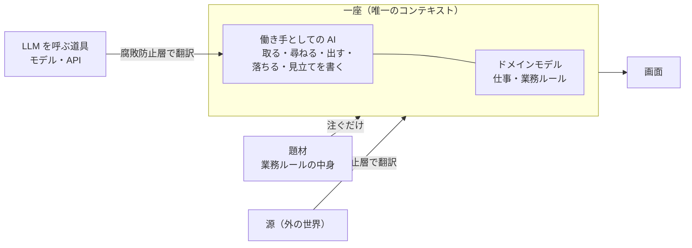
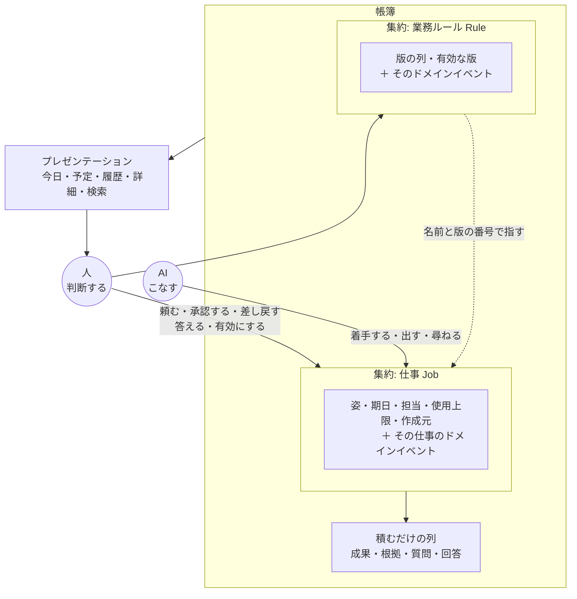

# Ichiza（一座）— ドメインモデル

**版**: v1.0（2026-08-21）
**役目**: **このシステムのドメインは何か。中核はどこか。構成要素は何に当たるか。**
設計の全体像を1枚で。個々の詳しさは各文書へ。

---

## 1. ドメイン

**仕事を落とさずに回し、判断を人に残すこと。**

ソフトウェアの外側にある現実はこうなっている——人が繰り返し仕事を頼み、誰かがやり、
終わったかを誰かが確かめる。落ちる仕事があり、思い出さないと始まらない仕事があり、
終わったことになっているのに終わっていない仕事がある。

一座は、そこに AI を入れる。**AI が回し、人が判断する。**

### 公理

**判断は人間。**

AI は仕事を作り、こなし、検査し、並べる。**決めない。**
承認・差し戻し・有効化・回答の4つだけは、人しか起こせない。

### AI から人への道は2つ

**自律とは、AI が黙って回ることではない。** 読んで、言うこと。

| | 何か | 判断か |
|---|---|---|
| **質問** | 材料が足りない。答えをください | いいえ |
| **見立て** | 状況を読んだ結果。**こうだと思う・こうすべきだと思う** | **いいえ。人が決める材料** |

**見立てが無いと、AI は数字しか出せない。**
「20回使い切りました」ではなく「20回とも同じ理由で落ちました。源の在りかが
変わった可能性が高い」と言えること——これが機械と AI の違いで、
この仕組みの値打ちそのもの。

見立ては**判断ではない**。書いても公理は破れない。決めるのは人。

---

## 2. サブドメインの三分類

| 分類 | 領域 | 扱い |
|---|---|---|
| **中核** | 仕事の一生／人の承認と差し戻し／終わったと言える根拠／業務ルールの版と有効化／**AI が仕事を1件こなす筋道**（取る・尋ねる・出す・落ちる・見立てを書く） | **作り込む。** ここの出来がこの仕組みの価値そのもの |
| **支援** | 題材ごとの業務ルールの中身（運転・庶務・訪問診療）／画面の見せかた | 薄く作る。中身は**データで注ぐ**、コードにしない |
| **汎用** | 保存／周期で回す仕組み／**AI が常駐する仕組み**／排他制御／**LLM を呼ぶ道具**（モデル・API・応答の受け取り）／画面の部品 | **買う・借りる。作らない** |

### 中核に入れない4つ

前回はここを間違えて、**中核が2つぶん膨らんだ**。膨らんだぶんが domain 層に流れ込み、
そこにロックと外の道具の interface と画面の読みがくっついてきて、domain の3割が掟以外で埋まった。

| 入れないもの | なぜ |
|---|---|
| 周期で回すこと | **アプリケーションサービス**。**何を作るべきかの突合は業務の判断**（ドメインサービス `reconcile`）だが、**それを何分ごとに回すかは実行の都合** |
| 担当を期限で外す仕掛け | **排他制御**。「誰が担当か」は業務の語だが、「時間切れで戻る」は技術 |
| 保存の仕組み・楽観ロック | **技術**。業務の語ではない |
| 画面の並び順・見出し・件数 | **見せかた**。「何を出すか」は業務、「どう並べるか」は画面 |

**判定の1行**: それは**業務の判断が要るか**。要らないなら中核ではない。

### AI は2つに分かれる（ここを分けていなかった）

**2026-08-21 まで、AI を「AI の呼び出し」の1語で汎用に入れ、コンテキストの外に置いていた。**
そのせいで AI が起こす操作の入口が無くなり、ロールプレイでうまくいく週が
月曜の配布直後に1手も進まなくなった。

| | どちらか | なぜ |
|---|---|---|
| **LLM を呼ぶ道具**（モデル・API・応答の受け取り） | **外・汎用** | どこにでもある。買う。差し替わる |
| **働き手としての AI**（担当を持ち、取り、尋ね、出し、落ち、見立てを書く） | **中・中核** | この筋道の出来が、この仕組みの値打ちそのもの。**判断はしないが、判断しないことを守る規則が要る** |

**分けないと、後者が前者と一緒に外へ出る。** 実際に出た。

---

## 3. 境界づけられたコンテキスト

いまコンテキストは**1つ**。名前は「一座」。この中で語は1つの意味を持つ。

- **題材 → 一座**は**注入だけ**。一座は題材の中身を1行も知らない。逆流しない
- **源 → 一座**は**腐敗防止層**で翻訳する。源の言葉（行・列・ファイル）が中心へ入らない
- **LLM → 働き手**も**腐敗防止層で翻訳する**（2026-08-21 に足した）。
  **AI の応答は外の言葉**——プロンプト・トークン・生成された文字列。
  それを成果・質問・見立てという中の語へ翻訳する道が要る。
  源には翻訳を置いたのに、AI には置いていなかった
- **帳簿・時計・画面**はこの外側。中心はどれも知らない
- **働き手としての AI は中**。担当を持ち、集約を動かす。だから中心が知っている

### 分かれる合図

いまは1つでよい。次のどれかが起きたら分けることを考える。

1. 同じ語に「〜の場合の」という注釈が要り始めたとき
2. 片方の題材でだけ効く規則が出てきたとき
3. 1回の書き込みで2つの集約を触りたくなったとき

---

## 4. モデルの全体像

---

## 5. 構成要素の割り当て（**探しものはここから**）

DDD の構成要素が、一座では何に当たるか。**詳しさは右の文書に。**

### 戦術的設計

| 構成要素 | 一座では | 文書 |
|---|---|---|
| **値オブジェクト** | 期日・使用上限・担当・対象期間・根拠・承認・差し戻し・版・周期・作成元・仕事の識別子・業務ルールの識別子 | [値オブジェクトとエンティティ](値オブジェクトとエンティティ.md) |
| **エンティティ** | 仕事 `Job`・業務ルール `Rule` | 同上 |
| **集約 / 集約ルート** | 仕事・業務ルール（**2つだけ**） | [集約と不変条件](集約と不変条件.md) |
| **不変条件** | I1〜I12。うち**境界を要求したのは2つ**——そこから集約が2つ決まった | 同上 |
| **ドメインサービス** | 検査 `Check`・今日の判定 `judge_today`・作成の突合 `reconcile` | [ドメインサービスと仕様](ドメインサービスと仕様.md) |
| **仕様（Specification）** | 受け入れ基準を満たすか・検索条件に合うか・根拠が揃ったか | 同上 |
| **ポリシー** | 業務ルールの版（**データとして持ち、人が有効にする**） | 同上 |
| **ファクトリ** | 仕事の生成 `new_job`・帳簿からの再構成 `reconstitute` | [ファクトリとリポジトリ](ファクトリとリポジトリ.md) |
| **リポジトリ** | 仕事の Repository・業務ルールの Repository（**集約ルートにつき1つ**） | 同上 |
| **ドメインイベント** | 過去形・観察だけ・積むだけ | [ドメインイベント](ドメインイベント.md) |
| **積むだけの列** | 成果・根拠・質問と回答・**見立て**。集約の外に置き、在りかで指す | [集約と不変条件](集約と不変条件.md) |

### アーキテクチャ

| 構成要素 | 一座では | 文書 |
|---|---|---|
| **アプリケーションサービス** | 人が始めるもの・時計が始めるもの。**業務の規則を1行も持たない** | [アプリケーションサービス](アプリケーションサービス.md) |
| **プレゼンテーション** | 今日・予定・履歴・詳細・検索。**ドメインの型を知らない** | [プレゼンテーション](プレゼンテーション.md) |
| **DTO** | 画面へ渡す値。文字と ID だけ。詰め替えるのは app | 同上 |
| **層・依存性逆転** | domain ← app ← adapters／ui。依存は内向きのみ | [ドメインモデル §7](ドメインモデル.md) |
| **腐敗防止層** | 源ごとの Port と、**LLM の Port**。外の言葉を業務の語へ翻訳する | 同上 |

### 支えるもの

| | 文書 |
|---|---|
| 何が起きてはいけないか（**設計全部の源**） | [起きてはいけないこと](起きてはいけないこと.md) |
| 仕事の状態と遷移（**状態の正本**） | [仕事の一生](仕事の一生.md) |
| 語と識別子 | [用語集](用語集.md) |
| 書けてはいけない値と状態 | [型で殺す](型で殺す.md) |
| 何が何を赤くするか | [はじめに 掟7の2](はじめに.md) |

---

## 6. モデルの要（なぜ集約が2つなのか）

**集約は「境界が要る」と言えた不変条件からしか作らない。**

「境界が要る」とは、**2つ以上のものを1回の書き込みで守らないと壊れる**こと。
[集約と不変条件](集約と不変条件.md)を12個並べて、そう言えたのは2つだけだった。

| 不変条件 | 何と何を1回で | できた集約 |
|---|---|---|
| **I1** 姿が変わったら、理由のドメインイベントが必ず一緒に残る | 仕事の姿 ＋ その仕事のイベント | **仕事** |
| **I2** 版は積むだけ。追加と、追加したイベントが一緒に残る | 版の列 ＋ そのイベント | **業務ルール** |

残る10個は、型か、1つの集約の中の操作か、鍵の一意で守れる。**だから集約にしない。**

前回は集約を6つ置いて、**どれも要求した不変条件を指せなかった**。
I1 に当たるものを実際に守っていたのは帳簿の一意制約で、集約ではなかった。

---

## 7. 層と、置いてはいけないもの

**依存は内向きのみ。** これがオニオンアーキテクチャの主張の全部で、他は言い換えにすぎない。

**「置いてはいけないもの」を先に書く。** 置いてよいものだけを書くと、隙間に何でも入る。
前回は中心 1,539行のうち451行が掟以外だった——外の道具の interface・画面の読み・楽観ロック。

| 層 | **置いてはいけないもの** | 置くもの |
|---|---|---|
| **domain**（中心） | **時計・乱数・保存・画面・外の道具**。「いま」は引数で受け取る | 値オブジェクト・エンティティ・集約・不変条件・ドメインサービス・仕様・ドメインイベントの名前 |
| **app**（アプリケーションサービス） | **業務の規則。** `if` で業務を判断したくなったら、集約かドメインサービスへ | ユースケースの入口・ひと仕事のトランザクション境界・DTO への詰め替え |
| **adapters** | **業務の規則。** 翻訳と入出力だけ | 帳簿の実装・Port の実装・腐敗防止層 |
| **ui**（プレゼンテーション） | **業務の規則。** 並べる・整える・受け取るだけ | 画面の部品。**domain を知らない** |

**「業務の規則を置いてはいけない」が3層に書いてある。** 規則が置けるのは中心だけ。

### interface をどこに宣言するか

前回いちばん壊れたところ。**中心に interface が12個あって、Repository はそのうち4つだけ**。
AI の interface も画面の読み取りも中心に居た——AI を「汎用＝買う」と自分で分類したのに、
その interface を中核に置いた。

| interface | 宣言する層 | 実装する層 |
|---|---|---|
| **Repository**（集約ルートの出し入れ） | **domain** | adapters |
| **Store**（積むだけの列） | **domain** | adapters |
| **Port**（外の道具——AI・源・設定） | **app** | adapters |
| **Reader**（参照だけ。書かない） | **app** | adapters |

詳しさは[ファクトリとリポジトリ](ファクトリとリポジトリ.md)。

### ロックはどこに置くか

**技術的関心であって、業務の語ではない。**
前回は楽観ロックが中心の interface の引数に露出し、
「期限で自動的に戻る仕掛け」が中核に入っていた。

| もの | どこ | なぜ |
|---|---|---|
| 楽観ロック（版数） | **adapters の中に隠す** | Repository が返すのは「書けたか／書けなかったか」だけ |
| 担当が誰か | **domain** | 業務の語 |
| 期限が来たら担当を外す | **app** | 排他制御の仕掛け。業務の判断ではない |
