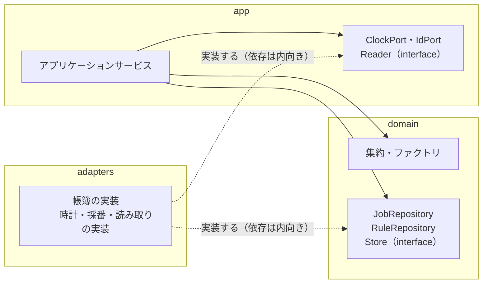

# Ichiza（一座）— ファクトリとリポジトリ

**版**: v1.0（2026-08-21）
**役目**: 仕事が**生まれる場所**と、帳簿・外の道具との**境目にある interface** を決める。どちらも確実にコードになる物なのに、ここまで住所も義務も無かった。

---

## 1. なぜファクトリが要るか

**不変条件を満たしたものだけが生まれることを保証するため。** 「`new` を隠すため」ではない。

隠すだけのファクトリは、規則を1つも持たないファクトリになる。それは関数を1枚増やしただけで、何も守らない。

仕事が生まれる瞬間にしか効かせられない規則がある——期日の決めかた、版の固定、作成元の組み立て、初期状態、最初のドメインイベント。これを呼び出し側に散らすと、**呼び出し側の数だけ抜けが増える**。生まれる場所を1つにするのは、抜けを1箇所に閉じ込めるため。

ここまでの設計に「ファクトリ」の語が無かった。だから**期日が何から決まるかを書く場所も無かった。** それがこの文書の §2。

| 主張 | なぜ | 執行者 | 壊しかた |
|---|---|---|---|
| ファクトリを通らずに `Job` を組み立てられない | 生まれた時点で不変条件を満たすため | まだ居ない（突合） | app か adapters が `Job(...)` を直に呼んでいたら赤 |
| 規則を1つも持たないファクトリは置かない | 「`new` を隠すだけ」のファクトリは、隠したぶん見えなくなるだけ | まだ居ない（検査） | 検証も計算も持たないファクトリがあったら赤 |
| ファクトリは domain に住む | 効かせるのは業務の規則。規則が置けるのは中心だけ | まだ居ない（突合） | app にファクトリが居たら赤 |
| ファクトリは帳簿を知らない | 生成は保存ではない。保存を混ぜると、生成が試せなくなる | まだ居ない（型） | ファクトリが Repository を引数に取っていたら赤 |

---

## 2. 仕事は何から決まるか

生成は `new_job`。**生まれの材料**を1つの型で受け取る。

```
# domain
Birth = FromRule(version: Version, period: Period) | FromRequest(request: Request)

def new_job(job_id: JobId, birth: Birth, now: Instant) -> JobChange
```

`FromRule` は版と対象期間を両方持たないと作れない。これで「業務ルール発なのに対象期間が無い仕事」が型で死ぬ。
戻り値が `Job` ではなく `JobChange`（姿と出来事の対）なのは §11 の理由。

| 持ちもの | 何から決まるか | 執行者 | 壊しかた |
|---|---|---|---|
| 仕事の識別子 `JobId` | **引数。ファクトリの外で振られる**（§6） | まだ居ない（突合） | ファクトリが自分で振っていたら赤 |
| 作成元 `Origin` | **`Birth` からファクトリが組み立てる。** 業務ルール発なら `RuleName`＋版の番号＋`Period`、依頼発なら依頼の識別子 | まだ居ない（型） | `Origin` を引数に取っていたら赤／作成元なしの仕事が作れたら赤 |
| 版の固定 | 生成の時点で有効だった**版の番号を写して持つ**。あとで版が積まれても書き換えない | まだ居ない（検査） | 版を足したあと、既にある仕事の版の番号が動いたら赤 |
| 受け入れ基準 `AcceptanceCriteria` | **固定した版から写す。** 業務ルールのいまの版からは取らない | まだ居ない（検査） | 版を足したあと、既にある仕事の受け入れ基準が変わったら赤 |
| 使用上限 `Budget` | 固定した版から写す | まだ居ない（型） | 上限を持たない版から仕事が作れたら赤 |
| 期日 `DueDate` | **作られた時刻 ＋ 版の日数。** 版が「何日で終える仕事か」を持ち、ファクトリが `now` に足す | まだ居ない（検査） | 版の日数を変えても期日が変わらなかったら赤／`now` より前の期日が作れたら赤（I12） |
| 対象期間 `Period` | `FromRule` が持つ。app が周期 `Cycle` と `now` から決めて渡す | まだ居ない（型） | 対象期間なしで `FromRule` が作れたら赤 |
| 担当 `Assignee` | **持たない。** 生まれた時点では誰の担当でもない | まだ居ない（型） | 生まれたばかりの仕事が担当を持っていたら赤 |
| 初期状態 | 「作られた」。配る前で、着手できない | まだ居ない（型） | 生まれた仕事がそのまま着手できたら赤 |
| 最初のドメインイベント | `JobCreated` を必ず持って生まれる。依頼発は `JobRequested` も | まだ居ない（型） | イベントを持たない仕事が作れたら赤（I1） |

**なぜ期日をここで決めるのか。** 期日は「業務の判断が要るもの」——何日で終える仕事かは業務ルールが決める。呼び出し側が計算すると、呼び出し側ごとに違う期日が入る。そして期日は F1（気づかれず期日を過ぎる）の土台なので、無い仕事が1件でもあると F1 が丸ごと効かなくなる。

**版が日数と使用上限を持つ必要がある。** いまの `Version` の義務にこれが無い。§13 で前に戻して直す。

---

## 3. 依頼から生まれる場合との違い

| 持ちもの | 業務ルール発 `FromRule` | 依頼発 `FromRequest` |
|---|---|---|
| 作成元 | `RuleName`＋版の番号＋`Period` | 依頼の識別子 |
| 対象期間 | 必ず持つ | **持たない** |
| 版の固定 | する | **無い。** 元になる版が無い |
| 受け入れ基準 | 固定した版から写す | 依頼が持つ。空では依頼が作れないので、必ず在る |
| 使用上限 | 固定した版から写す | 依頼が持つ。既定を置きたくなったら設定の Port が要る（§9） |
| 期日 | 作られた時刻 ＋ 版の日数 | **依頼が持つ期日。** 人が決める。ここで I12（依頼された時刻より後）を効かせる |
| 最初のドメインイベント | `JobCreated` | `JobRequested` と `JobCreated` |
| 識別子・担当・初期状態 | 同じ | 同じ |

**違うのは「何から決まるか」だけで、生まれたあとの一生は同じ。**
一生を2本にすると状態が倍になり、片方だけ直す事故が必ず起きる。だから入口は `new_job` ひとつで、分かれるのは中だけにする。

---

## 4. 生成と再構成は、まったく別の操作

**帳簿から戻すときに業務の規則を効かせてはいけない。**
効かせると、きのう書いた記録をきょうの規則で弾くことになる。これは「仕事は生まれた版で裁かれる」に正面から反する。

| | 生成 `new_job` | 再構成 `reconstitute` |
|---|---|---|
| 何をするか | 業務の規則を効かせて、新しい仕事を作る | 帳簿に残っている姿を、そのまま型に戻す |
| いつ走るか | 仕事が初めて生まれるとき、1回だけ | 帳簿から読むたび、何度でも |
| 業務の規則（期日・上限・基準・初期状態） | **効かせる** | **効かせない。** 計算し直さない・既定で埋めない |
| 識別子 | 外から受け取る | 帳簿に書かれているものをそのまま使う |
| ドメインイベント | 新しいものを持って生まれる | **1件も起こさない** |
| 読めなかったとき | 作らずに呼び出し側へ返す | **開かない。** 黙って直さない（I10・F7） |
| 住むところ | domain | domain |
| 誰が呼ぶか | app | **adapters**（Repository の実装） |

| 主張 | なぜ | 執行者 | 壊しかた |
|---|---|---|---|
| 生成と再構成を同じ関数にしない | 同じにすると、読むたびにきょうの規則が走る | まだ居ない（突合） | 引数の旗で生成と再構成を切り替えていたら赤 |
| 再構成は値を直さない・既定で埋めない | 埋めた瞬間、帳簿と型の中身が食い違う。F7 の作りかた | まだ居ない（検査） | 期日の欠けた古い記録を再構成して、期日が入っていたら赤 |
| 再構成はイベントを起こさない | 読んだだけで履歴が伸びると、F4 の説明が読めなくなる | まだ居ない（検査） | 1件読んで出来事が増えたら赤 |
| 再構成が読めない記録は、例外を上げる | 黙って動き続けるのが F7 そのもの | まだ居ない（検査） | 形の違う記録を読ませて、何事もなく通ったら赤 |

---

## 5. 採番はファクトリの外

**識別子を振るのは app。** `IdPort` から受け取り、ファクトリに渡す。ファクトリは振られたものを受け取るだけ。

| 主張 | なぜ | 執行者 | 壊しかた |
|---|---|---|---|
| ファクトリは識別子を振らない | 採番は時計・乱数・帳簿の連番に依る。domain に時計と乱数は置けない | まだ居ない（突合） | ファクトリが乱数か時計を呼んでいたら赤 |
| 同じ材料で2回呼ぶと、識別子以外は同じものが出る | 振らないから、生成が再現する。再現しない生成は試験が書けない | まだ居ない（検査） | 同じ `Birth`・同じ `now` で2回呼んで、期日か基準が違ったら赤 |
| 二度作らないを守るのは識別子ではなく `Origin` の一意 | だから識別子は決定的でなくてよい。ここを取り違えると、採番に一意を背負わせて採番が業務の規則になる | まだ居ない（検査） | 同じ `Origin` で2件書けたら赤（I3） |
| `IdPort` は app に宣言する | 外の道具。不変条件を1つも守らない（§10 の判定） | まだ居ない（突合） | domain に `Port` で終わる名前が現れたら赤 |

---

## 6. 接尾辞の決まり

| 接尾辞 | 何のための interface か | 書くか | 宣言する層 | 実装する層 |
|---|---|---|---|---|
| `Repository` | 集約ルートの出し入れ | 書く（`save` は姿と出来事の対） | domain | adapters |
| `Store` | 積むだけの列 | **積むだけ。** 書き換えも消しも生やさない | domain | adapters |
| `Port` | 外の道具 | 道具しだい | **app** | adapters |
| `Reader` | 参照だけ | **書かない** | **app** | adapters |

---

## 7. interface の一覧（**正本**）

| interface | 接尾辞 | 何を出し入れするか | 宣言する層 | 実装する層 | これを要求した集約またはアプリケーションサービス | 執行者 | 壊しかた |
|---|---|---|---|---|---|---|---|
| `JobRepository` | Repository | 仕事の集約ルートを鍵で1件、出し入れする | domain | adapters | 集約: 仕事（**I1**） | まだ居ない（突合） | 集約ルート以外を返す関数が生えたら赤 |
| `RuleRepository` | Repository | 業務ルールの集約ルートを鍵で1件、出し入れする | domain | adapters | 集約: 業務ルール（**I2**） | まだ居ない（突合） | 版を単体で出し入れする関数が生えたら赤 |
| `ResultStore` | Store | 成果を積む。出したら差し替えない | domain | adapters | 集約: 仕事（成果は集約の外の積むだけの列）／`run_check` が読む | まだ居ない（型） | 同じ在りかに2度目が書けたら赤 |
| `EvidenceStore` | Store | 根拠を積む | domain | adapters | 集約: 仕事（I5）／`confirm` が読む | まだ居ない（型） | 積んだ根拠を消せたら赤 |
| `QuestionStore` | Store | 質問と、それに付いた回答を積む | domain | adapters | `answer` | まだ居ない（型） | 質問なしで回答だけ積めたら赤 |
| `ClockPort` | Port | いまの時刻を出す | **app** | adapters | 時計が始めるものすべて／`new_job` に渡す `now` | まだ居ない（突合） | domain が時計を直に呼んでいたら赤 |
| `IdPort` | Port | 新しい識別子を振る | **app** | adapters | `request`・`create` | まだ居ない（突合） | ファクトリが呼んでいたら赤 |
| `ActiveRuleReader` | Reader | 有効な業務ルールの識別子と版の番号を読む | **app** | adapters | `create` | まだ居ない（突合） | 書く関数が生えたら赤 |
| `JobStateReader` | Reader | ある状態の仕事の**識別子だけ**を読む | **app** | adapters | `hand_out`・`return_timed_out`・`run_check`・`sort_failures`・`confirm` | まだ居ない（型） | 集約を返していたら赤 |
| `TodayReader` | Reader | 今日に出す材料を、文字と ID で読む | **app** | adapters | `gather_today` | まだ居ない（型） | ドメインの型を返していたら赤 |

### 一覧の決まり

| 決まり | なぜ | 執行者 | 壊しかた |
|---|---|---|---|
| **Repository は集約ルートにつき1つだけ。** 集約ルート以外を出し入れする Repository を作らない | 2つ目があると、どちらから書いても不変条件が守られると思ってしまう | まだ居ない（突合） | `ResultRepository` のような名前が生えたら赤 |
| **Repository が返すのは集約ルートだけ。** 中の部品を返さない | 部品を外に出すと、境界の外で書き換えられる | まだ居ない（突合） | 版や出来事を単体で返す関数が生えたら赤 |
| **Repository は鍵で1件。一覧と絞り込みは Reader** | 前回、中心の interface に画面の絞り込みが入り込んだ | まだ居ない（突合） | domain の interface に検索条件の引数が現れたら赤 |
| **Reader は書かない** | 参照だけの約束が、この接尾辞の全部 | まだ居ない（突合） | `Reader` に `save`・`append`・`delete` が生えたら赤 |
| **Reader が返すのは、識別子か、文字と ID** | 集約を出す口を1つに保つため。画面は domain の型を知らない | まだ居ない（型） | Reader が集約を返していたら赤 |
| **Port は domain に現れない** | 外の道具は不変条件を1つも守らない（§10） | まだ居ない（突合） | domain に `Port` で終わる名前があったら赤 |
| **出来事だけを積む interface を置かない** | あると I1 を迂回できる。姿なしで出来事を書け、出来事なしで姿を書けてしまう | まだ居ない（突合） | `EventStore` が生えたら赤 |
| **要求者の欄が空になる interface は置かない** | 誰も呼ばない宣言が、前回いちばん増えた | まだ居ない（突合） | 一覧のどこかの要求者が空になったら赤 |

---

## 8. まだ置かない interface

要求するアプリケーションサービスがまだ決まっていないもの。**置かないことを書いておく。** 書かないと、あとで「無いのは抜けか、決めたのか」が分からなくなる。

| 置かないもの | 何がまだ決まっていないか | 置いてよくなる条件 |
|---|---|---|
| AI の Port | **AI に渡すアプリケーションサービスが一覧に無い** | §13 で一覧を直したとき |
| 源の Port（腐敗防止層） | 源から材料を読むアプリケーションサービスが無い | 材料を源から取ると決めたとき |
| 設定の Port | 題材の版を注ぐアプリケーションサービスが無い（`RuleVersionAdded` を起こす入口が一覧に無い） | 入口を一覧に足したとき |
| 画面の Reader（詳細・履歴・検索） | プレゼンテーションが未着手で、要求者が決まらない | プレゼンテーションを書いたとき |

---

## 9. 依存性逆転

domain は帳簿を**使う**が、帳簿を**知ってはいけない**。両立させる方法は1つしかない——**interface を domain 側に宣言し、実装する側を domain に依存させる。**

呼ぶ向きは変えない。変えるのは**矢印の向きだけ**。



### どちらの層に宣言するかの判定

**その interface が、不変条件を守る形をしているか。**

守っているなら domain。守っていないなら app。

- `JobRepository.save` は姿と出来事を1回で書く形をしている——**I1 そのもの**。だから domain
- `Store` は「積むだけ」を形にしている——書き換えと消しが無い。だから domain
- `ClockPort` も `Reader` も、不変条件を1つも守らない。だから app

前回はこの判定が無かったので、中心に interface が積み上がり、AI の interface まで中核に居た。AI を「汎用＝買う」と自分で分類しておいて、その interface を中心に置いていた。

| 主張 | なぜ | 執行者 | 壊しかた |
|---|---|---|---|
| domain の interface は、指せる不変条件を1つ持つ | 持てないなら app へ降ろす。判定を1行にして迷いを消す | まだ居ない（突合） | domain の interface に、指せる不変条件が無いものがあったら赤 |
| adapters は domain を import してよい。逆はしない | 依存は内向きのみ | まだ居ない（突合） | domain が adapters を import したら赤 |
| app は domain を import してよい。domain は app を知らない | 同上 | まだ居ない（突合） | domain が app を import したら赤 |

---

## 10. 書き込みの形——姿だけでは呼べなくする

**I1 の実物はここ。** 「状態が変わったら理由の出来事が必ず一緒に残る」を、掛け声ではなく**呼べない形**で守る。

```
# domain
@dataclass(frozen=True)
class Events:                     # 空では作れない
    first: JobEvent
    rest: tuple[JobEvent, ...] = ()

@dataclass(frozen=True)
class JobChange:
    job: Job
    because: Events

class JobRepository(Protocol):
    def load(self, job_id: JobId) -> Job | None: ...
    def save(self, change: JobChange) -> WriteOutcome: ...
```

業務ルールも同じ形で `RuleChange`。

| 主張 | なぜ | 執行者 | 壊しかた |
|---|---|---|---|
| `save` の引数は `JobChange` ひとつ | 姿だけを渡す呼び方が、そもそも書けない | まだ居ない（型） | `save(job)` が型検査を通ったら赤 |
| `Events` は空では作れない | 「理由なしの姿の変化」を型で潰す。ここが I1 の実物 | まだ居ない（型） | 空の `Events` が作れたら赤 |
| `JobChange` はイベントなしでは作れない | 上と同じことを、対の側からも塞ぐ | まだ居ない（型） | `JobChange(job)` が通ったら赤 |
| ファクトリも `JobChange` を返す | 生まれた瞬間から姿と出来事が対。入口を1つに揃える | まだ居ない（型） | `new_job` が `Job` を返していたら赤 |
| `save` は対を1回の書き込みで入れる | 分けて書くと、片方だけ残った帳簿ができる | まだ居ない（検査） | 出来事の書き込みだけ落として、姿が残ったら赤 |
| `load` は集約ルートだけを返す | 集約に触る入口を1つに保つ | まだ居ない（突合） | 中の部品を返す関数が生えたら赤 |

---

## 11. 楽観ロックを interface へ漏らさない

版数は**業務の語ではない**——用語集に無い。前回はこれが interface の引数に露出し、中心に技術が流れ込んだ。

**返すのは「書けたか／書けなかったか」だけ。**

```
WriteOutcome = Written | Rejected      # 版数は載らない
```

| 主張 | なぜ | 執行者 | 壊しかた |
|---|---|---|---|
| `save` の引数に版数が現れない | 引数に出た瞬間、呼び出し側が版数を持つことになる | まだ居ない（突合） | `save(change, version=…)` が通ったら赤 |
| `WriteOutcome` から版数が読めない | 戻り値に出れば、持ち回されて結局中心に戻ってくる | まだ居ない（型） | 戻り値から版数が取り出せたら赤 |
| 書けなかったときは `load` からやり直す | 版数を渡さないので、やり直しは読み直しになる。これでよい——やり直す範囲は1回の書き込みぶんだけ | まだ居ない（検査） | 2回目の `save` が前の版数を使い回していたら赤 |
| 版数が住むのは adapters | 帳簿の中の話。中心にも app にも出さない | まだ居ない（突合） | domain か app に版数の語が現れたら赤 |
| `Rejected` を握りつぶさない | 黙って捨てると、書けていないのに書けたことになる。F7 の作りかた | まだ居ない（検査） | `Rejected` を無視して先へ進んだら赤 |

---

## 12. 前に戻って直すこと

食い違いは、この文書で辻褄を合わせない。**前の文書を直す。**

| 直すもの | どこ | なぜここで分かったか | 執行者 | 壊しかた |
|---|---|---|---|---|
| `Version` の義務に「終えるまでの日数」を足す（1以上） | 値オブジェクトとエンティティ | 期日が「作られた時刻＋版の日数」だと決まったので、版が日数を持っていないと期日が作れない | まだ居ない（型） | 日数を持たない版から仕事が作れたら赤 |
| `Version` の義務に `Budget` を足す | 同上 | 使用上限を版から写すと決めたので、版が持っていないと写せない | まだ居ない（型） | 上限を持たない版から仕事が作れたら赤 |
| **AI に渡すアプリケーションサービスを一覧に足す** | アプリケーションサービス | あの一覧は「できることの全部」と書いてある。いま AI を呼ぶ入口が1つも無い | まだ居ない（突合） | 一覧に無い入口から AI が呼ばれていたら赤 |
| 版を積む入口を一覧に足す | 同上 | `RuleVersionAdded` は起きることになっているのに、それを起こす入口が無い | まだ居ない（突合） | 一覧に無い経路で版が積まれたら赤 |

---

## 13. この文書の執行者について

この文書の執行者は**型・検査・突合**を使う。人の目だけに頼った行は置かなかった——読まれない見張りは見張りではない。

いまはすべて「まだ居ない」。**括弧の中は、置くと決めた種類。** 種類まで書いておかないと、あとで全部を突合（名前と住むところの見張り）で埋めてしまう。前回それをやって、名前は揃い、住むところも揃い、中身だけが空になった。
