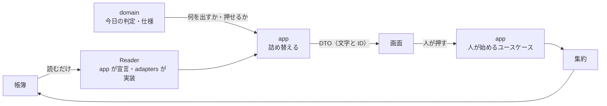

# Ichiza（一座）— プレゼンテーション

**版**: v1.1（2026-08-21）
**役目**: 画面と、画面へ渡す値を決める。**画面は業務の判断を1つもしない。**

前回、画面は集約とドメインの型をそのまま受け取っていた。
だから画面が中心の形を知っていて、ドメインを直すたび画面が壊れた。
画面のファイルが690行に膨らんだのも、集約を受け取っていたから。

**判定そのものはドメインサービスと仕様の仕事。ここは並べるだけ。**

---

## 1. プレゼンテーション層は、もっとも薄い

やることは2つだけ——**渡された値を並べる**。**人の操作を呼ぶ**。

| 主張 | なぜ | 執行者 | 壊しかた |
|---|---|---|---|
| 画面は渡された値を並べ、人の操作を呼ぶだけ | 業務の規則が画面にも入ると、本当の規則が2箇所になり、どちらが本当か言えなくなる | まだ居ない（突合：画面のコードに業務の判定が無いか） | 画面に業務の判定を書いて、突合が緑のままなら赤 |
| 画面は domain を import しない | 画面が中心の形を知ると、ドメインを直すたび画面が壊れる。前回それが起きた | まだ居ない（突合：依存の向き） | ui から domain を import して、突合が通ったら赤 |
| 画面は帳簿を直に読まない | 読む形を決めるのは app。画面が読み方を持つと、画面ごとに違う読み方が生まれる | まだ居ない（突合：依存の向き） | ui から帳簿・Reader を呼んで通ったら赤 |
| 画面は並べ替えない。受け取った順に出す | 文字と ID しか渡らないので、意味で並べ替える材料がそもそも無い | まだ居ない（検査） | 画面で並べ替えて、出た順が渡された順と違ったら赤 |
| 画面は「押せるか」を判定しない | 出し分けを画面が持つと、[I6・I7](集約と不変条件.md)と同じ規則が画面にも写る | まだ居ない（突合：画面のコードに業務の判定が無いか） | 画面で担当を見て出し分けたら赤 |

**画面で隠すのは親切であって、守りではない。** 実際に止めるのは集約。
画面の出し分けが全部破れても、帳簿は壊れない——そう作る。

---

## 2. 画面の一覧（**正本**）

| 画面 | 識別子 | 答える問い | 出すもの | どの失敗のためか | 執行者 | 壊しかた |
|---|---|---|---|---|---|---|
| **今日** | `Today` | いま私が判断することは何か | 警告の行（§8の条件を満たしたものだけ）。**各行が押せることを1つ持つ** | F1・F2・F3・F5・F6 | まだ居ない（検査） | §8の条件を満たす仕事を作り、今日に出ないのを見る |
| **予定** | `Schedule` | これから何が来るか | これから期日が来る仕事の行と、有効な業務ルールがこれから作る対象期間 | F2 | まだ居ない（検査） | 有効な業務ルールを足して、次の対象期間が出ないのを見る |
| **履歴** | `History` | この1件に何が起きたか | 出来事の行の列。時刻・誰が・何が起きたか | F4 | まだ居ない（検査） | 出来事を1つ積んで、履歴に出ないのを見る |
| **詳細** | `Detail` | この1件はいまどうなっているか。終わったと言える根拠は何か | 仕事1件、または業務ルール1件のいまの姿と、押せること | F4・F5 | まだ居ない（検査） | 根拠つきで終わった仕事を開き、根拠の引用が出ないのを見る |
| **検索** | `Search` | 条件に合う仕事はどれか | 絞り込んだ行の列 | F4 | まだ居ない（検査） | 条件に合う仕事を作り、結果に出ないのを見る |

**網羅も主張。** 上の各行が見るのは「出るはずのものが出るか」だけで、
**表に無いものが増えたこと**は1行も捉えない。だから網羅を表の外に太字で置かない（掟1）。

| 主張 | 執行者 | 壊しかた |
|---|---|---|
| この表が画面の正本。ここに無い画面は作らない | まだ居ない（突合：画面の実物を集めてこの表と突き合わせる） | 6つ目の画面を足して、突合が通ったら赤 |

**画面の名前は[用語集](用語集.md)に載せない。** 画面の都合であって業務の語ではない（掟4）。
`Today` だけは業務の語でもあるので用語集に居る——「いま人の目と判断が要る仕事の集まり」。

---

## 3. 押しつけは今日だけ

| 画面 | 押しつけ／引き出し | なぜ |
|---|---|---|
| **今日** | **押しつけ** | F1・F2 は「誰にも気づかれない」失敗。人が問いを持つのを待っていたら防げない |
| 予定・履歴・詳細・検索 | 引き出し | 人が問いを持って開く。問いの無いものを押しつけると、押しつけ全部が読まれなくなる |

**押しつけの枠は増やさない。** 押しつけが2つになると、人はどちらを見るか決められず、両方見なくなる。
これが F6「警告が読まれなくなる」への手当ての本体で、
残りの手当ては「今日に何を入れないか」（§8）にある。

| 主張 | 執行者 | 壊しかた |
|---|---|---|
| 押しつける画面は今日だけ | まだ居ない（突合：押しつけの枠を数える） | 2つ目の押しつけ画面を足して、突合が通ったら赤 |

---

## 4. 画面へ渡す値（DTO）

**画面に届くのは、文字と ID と、それらの列だけ。**
集約もエンティティも値オブジェクトもドメインイベントも、画面へ出さない。

**詰め替えるのはアプリケーションサービス。** 画面は詰め替えない。

| 主張 | なぜ | 執行者 | 壊しかた |
|---|---|---|---|
| 詰め替えは app | 画面が自分で詰め替えるには中心の形を知る必要がある。知った瞬間、ドメインを直すと画面が壊れる | まだ居ない（突合：依存の向き） | ui で集約から詰め替えて、突合が通ったら赤 |
| 時刻も期日も**整えた文字**で渡す | 整形が画面に散ると、画面ごとに違う言い方が生まれ、§7の突合ができなくなる | まだ居ない（型：欄は文字。日時の型は入らない） | 欄に日時の型を入れて型検査が通ったら赤／画面で日付を組み立てて赤 |
| 件数の欄を作らない | 列の長さがそれ。数を2箇所に持つと必ずずれる（掟3） | まだ居ない（型：欄は文字か ID か、それらの列。数の欄は入らない） | 件数の欄を足して型検査が通ったら赤 |

### 渡す値の型

**どれも振る舞いを持たない。** メソッドを持ちたくなったら、それは判定で、domain の仕事。

**ここは型で殺せる。** DTO を凍らせ、欄をプリミティブと ID と、それらの列に縛る。
ドメインの型を欄に入れた時点で型検査が赤くなり、属性を書き換えても赤くなる。
**「書けない」まで持っていけるのはこの節だけ**——他の節は突合と検査に頼るしかない。

| 渡す値 | 識別子 | 中身 | 義務 | 執行者 | 壊しかた |
|---|---|---|---|---|---|
| 行 | `JobRow` | 仕事の識別子・見出し・状態の名・期日・担当の名・押せること | 全部の欄が文字か ID か、それらの列。振る舞いを持たない | まだ居ない（型：凍った DTO・欄はプリミティブだけ） | 欄に `Job` を入れて型検査が通ったら赤／メソッドを足して通ったら赤 |
| 節 | `Section` | 節の名・行の列 | 名は[用語集](用語集.md)の語。行は app が並べた順のまま | まだ居ない（突合：§7 と同じ） | 用語集に無い名を付けて、突合が通ったら赤 |
| 詳細（仕事） | `JobDetail` | 仕事の識別子・状態の名・期日・担当・成果の在りか・根拠の引用・確かめ期日・押せること | **集約を1つも含まない**。根拠は引用の文字で渡す | まだ居ない（型：同上） | `Job` をそのまま渡して型検査が通ったら赤 |
| 詳細（業務ルール） | `RuleDetail` | 業務ルールの識別子・版の行の列・いま有効な版の番号・押せること | 同上 | まだ居ない（型：同上） | `Rule` をそのまま渡して型検査が通ったら赤 |
| 出来事の行 | `EventRow` | 時刻・誰が・何が起きたか | 「何が起きたか」は[ドメインイベント](ドメインイベント.md)の日本語そのまま。言い換えない | まだ居ない（突合：§7 と同じ） | 言い換えた文を入れて、§7の突合が通ったら赤 |
| 押せること | `Action` | 表に出る名・呼ぶユースケースの識別子・渡す ID | 名は[用語集](用語集.md)の操作の語。**押せるかを自分で判定しない** | まだ居ない（型：凍った DTO・メソッドを持たせない） | `Action` に判定のメソッドを足して型検査が通ったら赤 |
| 絞り込みの条件 | `SearchQuery` | 語・状態の名・対象期間・担当の名。全部文字 | 画面 → app の向きにだけ流れる。ドメインの型を持たない | まだ居ない（型：同上） | `Period` を画面から渡して型検査が通ったら赤 |

**1画面ぶんは節の列。** 画面ごとの入れ物の型を別に作らない——作ると画面が増えるたび型が増える。

---

### 見立ては、そのまま人に届く

**この仕組みの値打ちが、ここで人に渡る。** 見立てが画面の欄を持たないと、
座長に届くのは「20回使い切りました」という数字だけになる。

| 画面へ渡す欄 | 中身 | 執行者 | 壊しかた |
|---|---|---|---|
| 見立ての本文 | AI が読んだ結果、そのままの文 | まだ居ない（検査） | 要約や切り詰めが入ったら赤 |
| そう読んだ理由 | 何を見てそう思ったか | まだ居ない（検査） | 理由の空な見立てが画面に出たら赤 |
| いつ書かれたか | 時刻 | まだ居ない（型） | — |

**縮めない。** 縮めると、人が判断する材料が減る。長いなら画面を広げる。

## 5. 画面から呼べる操作

呼べるのは[アプリケーションサービス](アプリケーションサービス.md)の「人が始めるもの」だけ。
**操作の一覧はあちらが正本。この節に写さない**（掟3）。写すと、あちらに1行足した日にここがずれる。

この節が足すのは2つだけ——**どの画面から呼ぶか**と、**誰に出るか**。
左の欄は正本の行を指す鍵であって、一覧ではない。

| [「人が始めるもの」](アプリケーションサービス.md)の行 | どの画面から | 誰に出るか | 執行者 | 壊しかた |
|---|---|---|---|---|
| `request` | 今日・検索 | 誰にでも | まだ居ない（検査） | 押しても仕事が作られなければ赤 |
| `approve` | 今日・詳細 | **担当の人にだけ**（[I6](集約と不変条件.md)） | まだ居ない（検査） | 担当外の画面に出たら赤／出さずに集約が承認を通したら赤 |
| `send_back` | 今日・詳細 | **担当の人にだけ**（[I6](集約と不変条件.md)） | まだ居ない（検査） | 同上 |
| `answer` | 今日・詳細 | **尋ねられた人にだけ** | まだ居ない（検査） | 尋ねられていない人に出たら赤 |
| `activate` | 詳細（業務ルール） | **人にだけ**（[I7](集約と不変条件.md)） | まだ居ない（検査） | AI の経路から押せたら赤 |

**網羅は主張。** 上の各行が見るのは「出るはずのものが出るか」だけで、
正本に無い操作が画面に増えたことは捉えない（掟1）。

| 主張 | 執行者 | 壊しかた |
|---|---|---|
| この表の行と「人が始めるもの」の行は一対一 | まだ居ない（突合：「人が始めるもの」と §5 の表を突き合わせる） | アプリケーションサービスの一覧に無い操作を画面に出して、突合が通ったら赤 |
| 時計が始めるものは画面から呼べない | まだ居ない（突合：同じ突合） | 時計が始めるものを画面から押せるようにして、突合が通ったら赤 |

### 誰に出るかを決めるのは画面ではない

app が domain に尋ね、返ってきた `Action` を DTO に入れる。画面は入っているものを出すだけ。

**なぜ**: 画面が「担当の人か」を見て出し分けたら、業務の判断が画面へ移ったということ。
I6 と同じ規則が2箇所になり、片方だけ直る日が来る。

---

## 6. 参照の経路は集約を通らない

**読むだけなら、境界（集約）を要求する不変条件が無い。境界は書き込みのためにある。**
だから読みは帳簿から直に、画面に要る形で引いてよい。

**守るべき不変条件が無い、ではない。** [I8・I9](集約と不変条件.md)は結果として見張るもので、
破れが見えるのは今日の画面——**背負っているのは読みの道**。
だから下の表に「判定は app に書かない。Reader にも書かない」が要る。
境界が要らないことと、不変条件が無いことは別。

| 主張 | なぜ | 執行者 | 壊しかた |
|---|---|---|---|
| 一覧の読みは集約を再構成しない。Reader が画面に要る形で引く | N件出すのに N回再構成すると、遅いだけでなく、画面のために集約の形が引っ張られる。前回それが起きた | まだ居ない（突合：一覧の読みの経路） | 一覧の読みで集約を再構成して、突合が通ったら赤 |
| Reader は書かない | 読みの道で帳簿が変わると、[I1](集約と不変条件.md)（姿と出来事が一緒に残る）が読みの道から破れる | まだ居ない（突合：Reader の実装が帳簿へ書いていないか） | Reader に書き込みを足して通ったら赤 |
| **判定は app に書かない。Reader にも書かない** | 「今日に出るか」「押せるか」は業務の判断。ここに書くと規則が2箇所になる | まだ居ない（突合：app と Reader に今日の条件が無いか） | Reader の引きかたに今日の条件を書いて、突合が通ったら赤 |
| 引く条件は domain が組み、Reader は受け取って引くだけ | 条件を Reader が自分で決め始めたら、判定が adapters へ漏れた合図 | まだ居ない（突合：同上） | Reader が条件を自作して通ったら赤 |
| 書き込みは必ず集約を通る | I1・I2 は集約の中でしか守れない | まだ居ない（突合：書き込みの経路） | app から帳簿へ直に書いて通ったら赤 |

**役割の切れ目**——何を出すかは domain、どう引くかは Reader、どう詰めるかは app、どう見せるかは画面。

---

## 7. 画面に出る語は用語集の語そのまま

| 主張 | なぜ | 執行者 | 壊しかた |
|---|---|---|---|
| 画面に出る業務の語は[用語集](用語集.md)の語そのまま | 画面で言い換えると、人が言う語とコードの語が離れる。`grep 根拠` で設計から実装へ辿れなくなる | まだ居ない（突合：画面の文字列を集めて用語集と突き合わせる） | 画面に「証拠」と書いて、突合が通ったら赤 |
| 状態の名は[仕事の一生](仕事の一生.md)の名そのまま | 状態の正本は1つ。画面が別名を持つと、人と AI が違う言葉で同じ状態を呼ぶ | まだ居ない（突合：同上） | 状態を画面で言い換えて赤 |
| 出来事の文は[ドメインイベント](ドメインイベント.md)の日本語そのまま | 履歴は F4 の答え。言い換えると「誰が・いつ・何を・どうした」が設計と突き合わせられない | まだ居ない（突合：同上） | 出来事の文を画面で作り直して赤 |
| **読みにくいと分かったら、用語集で改名する** | 画面だけ直すと、その画面にしか無い語が生まれる。前回の299語はそうやって増えた | 人（画面を人に見せた日に読み合わせる） | 画面だけ直して用語集を直さない |

---

## 8. 今日に出す条件

**判定するのは今日の判定 `judge_today` と仕様。画面はその結果を並べるだけ。**
ここに並ぶのは「何を出すか」であって、「どう判定するか」ではない。

### 出す条件（1行1つ。各行が押せることを必ず1つ持つ）

| # | 出す条件 | なぜ人が要るか | 人がいま押せること | 効く失敗 | 執行者 | 壊しかた |
|---|---|---|---|---|---|---|
| **T1** | 承認を待っている | 外へ出る前の判断は人しかできない（[I4](集約と不変条件.md)） | 承認する／差し戻す | F3 | まだ居ない（検査） | 承認待ちを作り、今日に出ないのを見る |
| **T2** | 質問が答えを待っている | 材料が足りず、AI は進めない | 答える | F1 | まだ居ない（検査） | 質問を積み、今日に出ないのを見る |
| **T3** | 期日を過ぎていて、かつ人の判断を待っている | 期日を越えたものは放っておくと落ちる（[I9](集約と不変条件.md)） | 待っているもの（承認する／差し戻す／答える） | F1 | まだ居ない（検査） | 期日切れの承認待ちを作り、今日に出ないのを見る |
| **T4** | 有効な業務ルールの対象期間なのに、仕事が作られていない | 仕組みが取りこぼしている。次にどうするかは人が決める（[I8](集約と不変条件.md)） | 業務ルールを有効にする | F2 | まだ居ない（検査） | 突合を止めて1周期待ち、今日に出ないのを見る |
| **T5** | 根拠が無いまま終わりにした仕事の、確かめ期日が来た | 「終わった」と言える根拠を人が出す（[I5](集約と不変条件.md)）。答えは根拠になる | 答える | F5 | まだ居ない（検査） | 確かめ期日を過去にして、今日に出ないのを見る |
| **T6** | やり直しが尽きて、人へ上がった失敗 | 自動では直らない。次は人が決める | 頼む | F1 | まだ居ない（検査） | やり直し上限まで失敗させ、今日に出ないのを見る |

### 出さないもの

| 出さないもの | なぜ |
|---|---|
| 自動でやり直している最中の失敗 | 人がいま押せることが無い。尽きたら T6 で出る |
| 実行中の仕事 | AI が動いている。予定と詳細で見られる |
| 検査で止まった直後 | 仕分けが先。人へ上がったら T6 で出る |
| 期日が明日以降の仕事 | 今日の判断ではない。予定にある |
| 終わった仕事 | 履歴にある |

**なぜ**: 押せることの無い行を1行足すたび、押せる行が読まれなくなる（F6）。
「見せておく」は親切に見えて、今日を殺す。

| 主張 | 執行者 | 壊しかた |
|---|---|---|
| 今日の全部の行が、押せることをちょうど1つ以上持つ | まだ居ない（検査：今日の行を作って `Action` の数を見る） | `Action` の空な行を今日に出して、緑のままなら赤 |

---

## 9. 執行者の種類（**この文書の正本**）

**種類が偏ったら未完成。** 前回の仕掛けは全部「名前と住むところ」の見張りで、**型が0**だった。
名前は揃い、住むところも揃い、依存の向きも守られ、**中身だけが空だった**。
偏りは数えないと見えない。だから1箇所で数える。

**書きかた**: 執行者の欄は `まだ居ない（種類：どう見張るか）` か `人（いつ読むか）` の形で書く。
**形が揃っていないと数えられない。**

| 種類 | この文書では何を見張るか | 数 |
|---|---|---|
| **型** | DTO が凍っていて、欄にドメインの型も数の欄も入らない（§4） | 7 |
| **検査** | 出るはずのものが出るか。押せることが1つ以上あるか（§1・§2・§5・§8） | 18 |
| **突合** | 表と実物が合っているか。依存の向き・網羅・語（§1〜§7・§9） | 21 |
| **人** | 用語集の読み合わせ・戻る先の決定（§7・§10） | 2 |

**型がいちばん少ないのは、この層で型に殺せるものが DTO しか無いから。**
「画面に業務の判定を書かない」は型で書けない——書けてしまうコードだから突合で見張る。
**だが0にはしない。** 0に戻った日が、前回と同じ形に戻った日。

| 主張 | 執行者 | 壊しかた |
|---|---|---|
| どの種類も0にならない | まだ居ない（突合：この文書の執行者を種類ごとに数える） | §4 の型の行を全部「まだ居ない（突合：…）」に書き換えて、突合が通ったら赤 |
| この表の数と、実際の執行者の数が合う | まだ居ない（突合：同じ突合） | 行を1つ足して数を直さず、突合が通ったら赤 |

---

## 10. 戻る先（この文書では辻褄を合わせない）

書いていて、前の文書と食い違ったところが1つある。**ここに but 書きを足さない。**

| 食い違い | 何と何 | どちらかを直す |
|---|---|---|
| 期日を過ぎたのに、人がいま押せることが1つも無い仕事 | [I9](集約と不変条件.md)「期日の過ぎた仕事は必ず今日に出る」と、[用語集](用語集.md)の警告「人がいま押せることが無いものは含まない」 | ① [アプリケーションサービス](アプリケーションサービス.md)の「人が始めるもの」に、期日を引き直す操作を足す ② I9 を「人の判断を待っている期日切れ」に狭める |

**執行者**: 人（どちらにするか決める日）
**壊しかた**: 期日を過ぎて何も待っていない仕事を1件作り、今日に出るか出ないかを見る——
いまはどちらでも「正しい」と言えない。**言えないうちは T3 を完成と呼ばない。**
