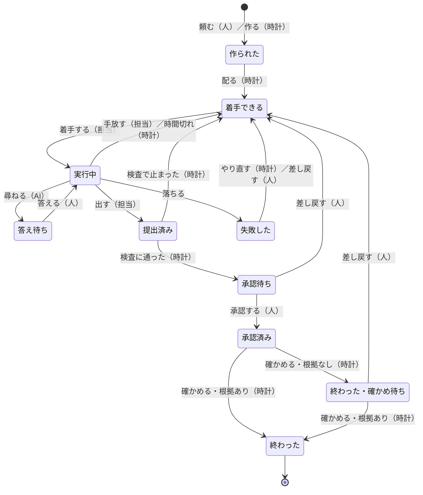

# Ichiza（一座）— 仕事の一生

**版**: v1.0（2026-08-21）
**役目**: 仕事がどの姿を取り、どこへ動けるかの**正本**。状態と遷移を数える場所はここだけ。

いままで状態は[値オブジェクトとエンティティ](値オブジェクトとエンティティ.md)の一生の欄と、
[型で殺す](型で殺す.md) §2 と、[ドメインイベント](ドメインイベント.md)の3箇所でばらばらに語られていた。
**状態が数えられないと、型で殺せない。** どの状態の型を作ればよいかが決まらないから。
[型で殺す](型で殺す.md) §2 の禁止状態は、この表の状態を材料に書く。

---

## 1. 状態の一覧（**正本**）

「必ず持つもの」が、その状態の型そのもの。**持たないと書けない**——それが禁止状態の実体になる。

| 状態 | 識別子 | この状態が必ず持つもの | ここへ動かせるのは | 執行者 | 壊しかた |
|---|---|---|---|---|---|
| **作られた** | `Created` | 作成元・期日・使用上限。ルール発なら対象期間。**担当を持たない** | 人（頼む）／時計（作る） | まだ居ない | 作成元なしで作れたら赤／担当つきで作れたら赤 |
| **着手できる** | `Ready` | **生まれた版（`RuleName`＋版の番号）**・期日・使用上限・使った量。**担当を持たない。承認を持たない** | 時計（配る・時間切れ・やり直し・検査で止める）／人（差し戻す）／担当（手放す） | まだ居ない | 受け入れ基準なしで作れたら赤／承認を持ったまま作れたら赤 |
| **実行中** | `InProgress` | **担当（人かAI）**・生まれた版・期日・使用上限・使った量 | 担当（着手する）／人（答える） | まだ居ない | 担当なしで作れたら赤 |
| **答え待ち** | `AwaitingAnswer` | 担当・**質問**。答えを持たない | AI（尋ねる） | まだ居ない | 質問なしで作れたら赤／答えを持ったまま作れたら赤 |
| **提出済み** | `Submitted` | **成果**・担当。検査の結果を持たない | 担当（出す） | まだ居ない | 成果なしで作れたら赤 |
| **承認待ち** | `AwaitingApproval` | 成果・**担当が `Human` であること**（I6） | 時計（検査に通す） | まだ居ない | 担当が `Agent` のまま作れたら赤 |
| **承認済み** | `Cleared` | **承認（誰が・いつ）**・成果。根拠はまだ無い | 人（承認する） | まだ居ない | 承認なしで作れたら赤 |
| **失敗した** | `Failed` | **落ちた中身**・やり直した回数・使った量。**担当を持たない** | AI（落ちたと残す）／時計（残り時間も回数も尽きたと見つける） | まだ居ない | 落ちた中身なしで作れたら赤 |
| **終わった（確かめ待ち）** | `FinishedPendingRecheck` | 承認・**確かめ期日**。根拠を持たない | 時計（確かめる） | まだ居ない | 根拠も確かめ期日も無い終わりが作れたら赤 |
| **終わった** | `Finished` | 承認・**根拠**。**終点。ここから動かない** | 時計（確かめる） | まだ居ない | 根拠なしで作れたら赤／ここから遷移が書けたら赤 |

**「承認済み」の識別子が `Cleared` なのはなぜか。** 承認という**事実**は出来事 `Approved`、承認が済んだ**姿**は状態。
別の語だから別の識別子を割り当てる（[用語集](用語集.md) §7）。同じ英語を2つの語に使うと、`grep` が両方を拾う。

**「終わった」が2つあるのはなぜか。** I5 が「根拠か確かめ期日が要る」と言っている。
確かめ期日つきの終わりは**まだ動く**——根拠が揃えば終点へ行く。終点と一緒の名前にすると、動かないものと動くものが1つの型に混ざる。

---

## 2. 遷移の一覧（**正本**）

**1行＝1本の遷移。行けない遷移は書かない**（§4）。イベントの欄が空の行は書けない——それが I1（§6）。

| から | へ | 起こす操作 | 必ず残るドメインイベント | 誰が | 執行者 | 壊しかた |
|---|---|---|---|---|---|---|
| （無い） | 作られた | 頼む `request` | `JobRequested` ＋ `JobCreated` | 人 | まだ居ない | 片方だけで書けたら赤 |
| （無い） | 作られた | 作る `create` | `JobCreated` | 時計 | まだ居ない | 同じ作成元で2件書けたら赤（I3） |
| 作られた | 着手できる | 配る `hand_out` | `JobHandedOut` | 時計 | まだ居ない | 二度配れたら赤 |
| 着手できる | 実行中 | 着手する `start` | `JobStarted` | 担当（人かAI） | まだ居ない | 担当を空のまま遷移できたら赤 |
| 実行中 | 着手できる | 手放す `release` | `JobReleased` | 担当 | まだ居ない | 担当を持ったまま着手できるへ行けたら赤 |
| 実行中 | 着手できる | 時間切れを戻す `return_timed_out` | `JobTimedOut` | 時計 | まだ居ない | 期限内の仕事を戻せたら赤 |
| 実行中 | 答え待ち | 尋ねる `ask` | `QuestionAsked` | AI | まだ居ない | 質問なしで遷移できたら赤 |
| 答え待ち | 実行中 | 答える `answer` | `QuestionAnswered` | 人 | まだ居ない | AI から答えられたら赤 |
| 実行中 | 提出済み | 出す `submit` | `ResultSubmitted` | 担当 | まだ居ない | 成果なしで出せたら赤 |
| 実行中 | 失敗した | 落ちる `fail` | `JobFailed` | AI／時計 | まだ居ない | 落ちた中身なしで遷移できたら赤 |
| 提出済み | 承認待ち | 検査を回す `run_check`（通った） | `CheckPassed` | 時計 | まだ居ない | 担当を人にせずに遷移できたら赤 |
| 提出済み | 着手できる | 検査を回す `run_check`（止まった） | `CheckStopped` | 時計 | まだ居ない | 止めた理由なしで遷移できたら赤 |
| 承認待ち | 承認済み | 承認する `approve` | `Approved` | **人**（担当の人） | まだ居ない | 担当でない人が承認できたら赤（I6）／AI から呼べたら赤 |
| 承認待ち | 着手できる | 差し戻す `send_back` | `SentBack` | **人** | まだ居ない | 理由なしで戻せたら赤／承認を持ったまま着手できるへ行けたら赤 |
| 失敗した | 着手できる | 失敗を仕分ける `sort_failures`（やり直す） | `Retried` | 時計 | まだ居ない | 使った量が上限に達しているのにやり直せたら赤 |
| 失敗した | 着手できる | 差し戻す `send_back` | `SentBack` | **人** | まだ居ない | 理由なしで戻せたら赤 |
| 承認済み | 終わった | 確かめる `confirm`（根拠が揃った） | `JobFinished`（根拠の在りか） | 時計 | まだ居ない | 根拠なしで終われたら赤 |
| 承認済み | 終わった（確かめ待ち） | 確かめる `confirm`（根拠が無い） | `JobFinished`（確かめ期日） | 時計 | まだ居ない | 確かめ期日なしで遷移できたら赤 |
| 終わった（確かめ待ち） | 終わった | 確かめる `confirm`（根拠が揃った） | `JobFinished`（根拠の在りか） | 時計 | まだ居ない | 根拠なしで遷移できたら赤 |
| 終わった（確かめ待ち） | 着手できる | 差し戻す `send_back` | `SentBack` | **人** | まだ居ない | 承認を持ったまま着手できるへ行けたら赤 |

**時間切れの遷移が中核に居てよい理由。** 「担当が外れて着手できるへ戻る」は仕事の姿が変わること＝業務。
**いつ切れるかを測るのは app**（排他制御）。[ドメインモデル](ドメインモデル.md)が「期限で外す仕掛けは app」と言っているのはそちらのこと。矛盾しない。

**`JobFinished` が2度残ることがある。** 根拠なしで終わりにし、あとで根拠が揃った仕事は、確かめ期日つきの終わりと根拠つきの終わりを両方持つ。
帳簿はそれを「根拠なしで終わりにした。あとで確かめた」と読める。**消さないから読める。**

---

## 3. 図

**戻り先が「着手できる」1つに集まっている。** これは§5で決めたこと。

---

## 4. 表に無い遷移は、型が作らせない

**「行けない」を表に書かない。** 書くと、読む者が「表を守る」ことになる。守るのは型。

| 仕掛け | どう効くか | 執行者 | 壊しかた |
|---|---|---|---|
| 状態は直和。上の一覧の姿しか存在しない | 「担当の無い実行中」を作る型が無い | まだ居ない | 一覧に無い姿を作れたら赤 |
| 遷移は関数。**その状態からしか呼べない** | 差し戻された仕事から承認済みへ行く関数が存在しない | まだ居ない | 着手できるから承認済みへ行く道が書けたら赤 |
| 遷移関数が返すのは**（次の状態, 出来事）の対**。片方だけ返せない | 出来事のない姿の変化が作れない | まだ居ない | 状態だけ返す遷移を1つ足して、書き込みが通ったら赤 |
| 着手できるが**承認を持たない**型である | 差し戻すと承認が落ちる。承認済みのまま戻れない | まだ居ない | 承認つきの着手できるが作れたら赤 |

[型で殺す](型で殺す.md) §2 の「差し戻された仕事が『承認済み』のまま」を殺しているのは、最後の行。
**禁止を書いたからではなく、その型が無いから書けない。**

---

## 5. 決めたこと

設計にまだ答えが無かった4つ。ここで決める。**理由の無い決めごとは書かない。**

### 「期日を過ぎた」は状態にしない。出来事だけにする

| 決め | 理由 |
|---|---|
| **状態にしない** | 期日を越えても、担当も材料もできることも変わらない。姿ではない。状態にすると全状態が「期限内／期限切れ」に倍増し、遷移が倍になる |
| **出来事は残す** | `DueDatePassed` は帳簿に一度だけ刻む。刻まれていれば「いつから落ちていたか」が読める（F4） |
| **今日に出すのは判定** | 「期日の過ぎた仕事は必ず今日に出る」（I9）は、期日といまを比べる**仕様**。状態を見ない。だから、どの状態の仕事でも期限切れなら出る |
| **刻む者を置く** | いま `DueDatePassed` を刻む者が居ない。**居ない出来事は前回の失敗そのもの**（宣言だけで、やる者がいない）。`gather_today` に書かせるのは駄目——あれは帳簿に書かないと決めてある。**[アプリケーションサービス](アプリケーションサービス.md) §2 に「期日切れを刻む」`mark_overdue` を足すこと**（§8） |

### 「答え待ち」は状態にする

| 理由 | |
|---|---|
| 人がいま押せることがある | `answer` は人の操作。押せる相手が居ることを状態で言えないと、今日に出す条件が判定側に散る（F6） |
| AI の持ち時間を食わせない | 人を待っている間は時間切れを数えない。状態にしないと、質問したまま担当が外れ、答えが来ても受け取る者が居ない |
| 質問と答えが対になる | `QuestionAsked` の次に来てよいのは `QuestionAnswered` だけ、と型で言える |

**尋ねられるのは AI だけ。** 質問は「材料が足りないから尋ねる」もので、判断を求めない。人の担当が詰まったときは手放す。

### 戻り先は、すべて「着手できる」

差し戻し・時間切れ・手放し・検査で止まった・やり直し——**全部おなじ場所へ戻す。**

| なぜ1つにするか |
|---|
| 戻り先が状態ごとに違うと、「どこへ戻るか」を覚えないと読めない。覚えるものが増えると設計と実装が離れる |
| 担当を持ったまま戻すと、落ちた AI・答えない人に仕事が張り付いて誰も気づかない（F1）。**着手できるは担当を持たない型**なので、戻した時点で必ず外れる |
| 戻った仕事は必ず材料と使用上限の残りを持つ。次に取った者が、積まれた理由（差し戻しの理由・止めた理由・落ちた中身）を読んで続きをできる |

**「失敗した」だけは状態にする。** 落ちた仕事をそのまま着手できるへ戻すと、同じ落ちかたを使用上限が尽きるまで繰り返す。
`sort_failures` が仕分けるまで誰も取れない場所が要る。
仕分けて**やり直せるなら着手できるへ、やり直せない（使用上限が尽きた）ならそこに残る**。残ったものは人の目が要るので今日に出る。人の出口は**差し戻し（理由つき）**だけ。

**「やめる」道はいまの設計に無い。** 用語集に無い語なので、ここでは作らない。要るなら用語集・ドメインイベント・アプリケーションサービスの3枚を同時に直す（§8）。

### 「外へ出た」と「承認済み」は同じ状態

[型で殺す](型で殺す.md) §2 は「外へ出た」と「承認済み」を別々に禁止していた。**1つにする。**

| 理由 |
|---|
| 承認が無ければ外へ出せない。外へ出てよくなった姿＝承認済み。2つ置くと「承認済みだが外へ出ていない」「外へ出たが承認が無い」の2つが型で作れてしまい、そこが F3 の穴になる |
| 「外へ出す」という操作も出来事も、いまどの文書にも無い。**やる者の居ない状態は置かない** |

**承認はすべての仕事が通る。** 「外向きの仕事だけ承認」にはしない——「外向きか」を表す語がいまの設計に無く、
足せば「外向きなのに内向きと印を付ける」道が開く（F3）。承認が多すぎて読まれなくなる（F6）なら、
それは仕事の粒度の問題で、業務ルールの版で直す。

---

## 6. この一生が I1 をどう満たすか

I1 ＝ **状態が変わったら、理由の出来事が必ず一緒に残る。**（F4「何が起きたか説明できない」の唯一の守り）

| 主張 | 執行者 | 壊しかた |
|---|---|---|
| **遷移表の各行が、必ず出来事を持つ。** 出来事の欄が空の行は書けない | まだ居ない | 出来事の欄が空の遷移を足して、検査が緑のままなら赤 |
| **姿を変える道は遷移関数だけ。** 状態への代入は無い（値オブジェクトは書き換えられない） | まだ居ない | 状態の属性に直接代入できたら赤 |
| **遷移関数は（次の状態, 出来事）の対を返す。** 状態だけ返す型が無い | まだ居ない | 状態だけ返す遷移を1つ足して、通ったら赤 |
| **書き込みは仕事の集約1回。** 姿と出来事が同じ書き込みに乗る | まだ居ない | 出来事なしで姿を書く道を1本足して、帳簿が受けたら赤 |
| **状態を変えない出来事は `DueDatePassed` ただ1つ。** それ以外に「姿は変わらないが残る出来事」を作らない | まだ居ない | 状態を変えない出来事を2つ目に足して、検査が緑なら赤 |

最後の行が要る理由——I1 は「姿が変わったら出来事」であって「出来事があれば姿が変わる」ではない。
**例外を数えられる形にしておかないと、例外が増えたときに気づけない。**
[集約と不変条件](集約と不変条件.md)が仕事を集約にしたのは I1 のため。この一生は、その集約の中身そのもの。

---

## 7. ドメインイベントとの突き合わせ

[ドメインイベント](ドメインイベント.md)の一覧と、§2 の遷移表を1対1で当てた。
**これは主張の表ではなく照合。執行者は遷移表の各行が持つ。**

| 出来事 | どの遷移に出るか |
|---|---|
| `JobRequested` | 無い → 作られた（頼む） |
| `JobCreated` | 無い → 作られた（頼む・作る） |
| `JobHandedOut` | 作られた → 着手できる |
| `JobStarted` | 着手できる → 実行中 |
| `JobReleased` | 実行中 → 着手できる（手放す） |
| `JobTimedOut` | 実行中 → 着手できる（時間切れ） |
| `ResultSubmitted` | 実行中 → 提出済み |
| `CheckPassed` | 提出済み → 承認待ち |
| `CheckStopped` | 提出済み → 着手できる |
| `Approved` | 承認待ち → 承認済み |
| `SentBack` | 承認待ち／失敗した／終わった（確かめ待ち） → 着手できる |
| `JobFinished` | 承認済み → 終わった／終わった（確かめ待ち）、確かめ待ち → 終わった |
| `JobFailed` | 実行中 → 失敗した |
| `Retried` | 失敗した → 着手できる |
| `QuestionAsked` | 実行中 → 答え待ち |
| `QuestionAnswered` | 答え待ち → 実行中 |
| **`DueDatePassed`** | **どの遷移にも出ない。** 状態を変えない出来事（§5・§6） |
| `RuleVersionAdded` | 出ない。**業務ルールの集約の出来事** |
| `RuleActivated` | 出ない。業務ルールの集約の出来事。ただし `create` の引き金 |

**元の一覧で行き場の無かった3つ**（`JobReleased`・`JobTimedOut`・`JobFailed`・`Retried`・`QuestionAsked`）は、
どれも遷移を持った。**残ったのは `DueDatePassed` だけ**——刻む者を置くと決めた（§5・§8）。

---

## 8. 前に戻ること（他の文書に要る直し）

この一生を正本にすると、**先に書いた文書と食い違う箇所が出る。ここで辻褄を合わせずに、前へ戻して直す。**

| 文書 | 何を直すか | なぜ |
|---|---|---|
| [ドメインイベント](ドメインイベント.md) | `JobFinished` の「何が残るか」を「**根拠の在りか、または確かめ期日**」にする | I5 が根拠なしの終わりを許している。いまの書きかたでは確かめ待ちへ入る遷移に出来事が無く、I1 が破れる |
| [型で殺す](型で殺す.md) §2 | 「承認なしに外へ出た仕事」と「差し戻された仕事が承認済みのまま」を、この一生の状態名で書き直す。「外へ出た」を「承認済み」に寄せる | §5 の決め。状態の正本がここに移った |
| [アプリケーションサービス](アプリケーションサービス.md) §2 | 時計が始めるものに「**期日切れを刻む**」`mark_overdue` を足す。既に刻んだ仕事は触らないので何度回しても同じ | `DueDatePassed` に刻む者が居ない |
| [アプリケーションサービス](アプリケーションサービス.md) §2 | `run_check` が通したとき、担当を人へ移すことを書く | 承認待ちの担当が `Human` でないと I6 が呼べない |
| [値オブジェクトとエンティティ](値オブジェクトとエンティティ.md) または [集約と不変条件](集約と不変条件.md) | **承認する人をどこから引くか**を決める。依頼発は `Request` の頼んだ人から引けるが、**業務ルール発は `Origin`（`RuleName`＋版の番号＋`Period`）から引けない**。`Origin` に足すか、仕事の持ちものに足すか | 1回の書き込みで業務ルールの集約を読みに行けない（境界の外は鍵で指す） |
| [集約と不変条件](集約と不変条件.md) | I6「承認できるのは担当の人だけ」の読みを確定する——**承認待ちの担当は必ず `Human`** | AI が担当のままだと誰も承認できない。読みが2通りある |

---

## 9. 用語集へ足すこと

[用語集](用語集.md)が日本語⇄英語の対を持つ唯一の場所。**状態の一覧の正本はこの文書、対は用語集にも要る。**

| 足す語 | 識別子 | なぜ足りないか |
|---|---|---|
| 状態の名（作られた・着手できる・実行中・答え待ち・提出済み・承認待ち・承認済み・失敗した・終わった） | §1 の識別子 | 業務の人が言う語で、コードの型名になる。用語集に無いと和名から勝手に名前を作る |
| **手放す** | `release` | `JobReleased` を起こす操作。操作の語に無い |
| **尋ねる** | `ask` | `QuestionAsked` を起こす操作。操作の語に無い |
| **期日切れを刻む** | `mark_overdue` | §8 で足す時計の操作 |

**「材料」をどうするか。** [型で殺す](型で殺す.md) §2 は「作業の材料が無い『着手できる』」と書いているが、
用語集に「材料」の行が無い。この文書では**受け入れ基準・期日・使用上限**の3つに開いた。
用語集に「材料」を足すか、型で殺す の側を3つに開くか、どちらかにすること。**語を増やさずに済む後者を勧める。**
