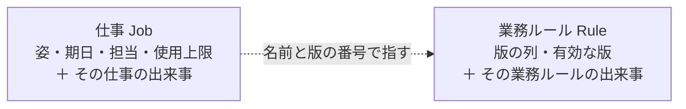

# Ichiza（一座）— 集約

**版**: v1.0（2026-08-21）
**役目**: [不変条件](不変条件.md)で「境界が要る」と書けたものだけを、境界にする。

**集約は2つ。** 前回は6つ置いて、どれも境界を要求した不変条件を指せなかった。
今回は逆から引いた——**要求した不変条件を指せない集約は置かない。**

---

## 1. 一覧（**正本**）

| 集約 | 鍵 | **これを要求した不変条件** | 中に持つもの | 1回の書き込みで守るもの |
|---|---|---|---|---|
| **仕事** `Job` | 仕事の名 | **I1**（状態が変わったら理由の出来事が必ず一緒に残る） | いまの姿・期日・担当・使用上限・作成元・その仕事の出来事 | 姿の変化と、その理由の出来事 |
| **業務ルール** `Rule` | 業務ルールの名 | **I2**（版は積むだけ。追加と出来事が一緒に残る） | 版の列・いま有効な版・その業務ルールの出来事 | 版の追加と、追加した出来事 |

---

## 2. 集約にしなかったもの

| もの | なぜ集約にしないか |
|---|---|
| 人・機体 | 名乗るだけ。1回の書き込みで守るものが無い。**値とエンティティで足りる** |
| 成果 | 出したら書き換えない。積むだけの列に置く |
| 根拠 | 同上 |
| 出来事 | 積むだけの列。集約の中から書かれる |
| 警告 | 保存しない。毎回作る |

前回はここを全部「集約」と呼んで、6つ置いた。名札を貼っただけで、**何を守るかを誰も言えなかった。**

---

## 3. 境界の外は、鍵で指す

- 仕事は業務ルールを**名前と版の番号で指す**。中身を抱え込まない
- **仕事は生まれた版で裁かれる。** あとで版が変わっても、その仕事は生まれた版の受け入れ基準で見る
- 1回の書き込みは1つの集約。2つの集約をまたぐ書き込みはしない

## 4. 図

