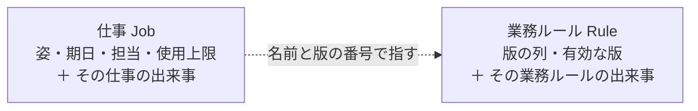

# Ichiza（一座）— 集約と不変条件

**版**: v1.0（2026-08-21）
**役目**: 常に真であるものを並べ、**どれが「境界」を要求するか**を決め、そこから集約を引く。

**境界が要るかの欄がこの表の核。** ここに「要る」と書けたものだけが[集約](集約と不変条件.md)になる。
前回は集約を6つ置いて、そのうち境界を要求した不変条件は**0**だった。
実際に守っていたのは帳簿の一意制約で、集約ではなかった。

「境界が要る」とは: **2つ以上のものを1回の書き込みで守らないと壊れる**、ということ。
1つのものの中で守れるなら、境界は要らない。

---

## 1. 不変条件の一覧（**正本**）

| # | 不変条件 | 境界が要るか | 守る場所 | 即時／結果 | 破れたときの見え方 | 執行者 | 壊しかた |
|---|---|---|---|---|---|---|---|
| **I1** | 状態が変わったら、**理由の出来事が必ず一緒に残る** | **要る**——姿と出来事の2つを1回で書く | 書き込みの門 | 即時 | 出来事の無い状態変化が拒まれる | まだ居ない | 出来事なしで状態を書く |
| **I2** | 版は積むだけ。**版の追加と、追加した出来事が一緒に残る** | **要る**——版の列と出来事の2つ | 書き込みの門 | 即時 | 版が減った書き込みが拒まれる | まだ居ない | 版を1つ消して書く |
| **I3** | 同じ依頼から仕事は二度作られない | 要らない——鍵の一意で足りる | 帳簿の一意の鍵 | 即時 | 2件目の書き込みが落ちる | まだ居ない | 同じ鍵で2回作る |
| **I4** | 承認なしに外へ出ない | 要らない——1つの仕事の中 | 型（外へ出た状態が承認を必ず持つ） | 即時 | その状態が作れない | まだ居ない | 承認を持たずに作る |
| **I5** | 終わったと言うには、根拠か確かめ期日が要る | 要らない——1つの仕事の中 | 型（終わりが2種だけ） | 即時 | どちらも無い終わりが作れない | まだ居ない | 両方なしで作る |
| **I6** | 承認できるのは**担当の人だけ** | 要らない——1つの仕事の中 | 承認の操作 | 即時 | 担当外の承認が失敗し、試みが出来事に残る | まだ居ない | 担当外で承認する |
| **I7** | **人しか起こせない操作は、AI から呼べない**——承認・差し戻し・回答・有効化の4つ（**公理「判断は人間」の執行者**） | 要らない | 4つの操作それぞれ | 即時 | AI が呼ぶと落ちる。試みが出来事に残る | まだ居ない | AI から承認を呼ぶ |
| **I13** | AI が動かせるのは、**自分が担当の仕事だけ** | 要らない——1つの仕事の中 | AI が起こす操作（取る・尋ねる・出す・落ちる・手放す） | 即時 | 他人の担当を動かせない | まだ居ない | 別の担当の仕事を動かす |
| **I14** | 使った量は**使用上限を超えない**——超える前に AI は必ず**見立てを書く** | 要らない——1つの仕事の中 | 使った量を増やす操作 | 即時 | 上限を超えた仕事が作れない | まだ居ない | 上限を超える使った量で作る |
| **I8** | 業務ルールが有効なら、その対象期間の仕事が必ず存在する | 要らない | 周期で回る突合 | **結果** | 作られていない仕事が今日に赤く出る | まだ居ない | 突合を止めて1周期待つ |
| **I9** | 期日の過ぎた仕事のうち、**人がいま押せる操作を持つもの**は必ず今日に出る | 要らない | 警告の判定 | **結果** | 期日切れが今日に出ない | まだ居ない | 判定から期日の行を消す |
| **I10** | 帳簿は自分の形を名乗り、合わなければ開かない | 要らない | 開くときの検査 | 即時 | 形の違う帳簿で開けない | まだ居ない | 番号を変えて開く |
| **I12** | 期日は**依頼された時刻より後** | 要らない——1つの仕事の中 | 仕事を作る操作 | 即時 | 過去の期日で仕事が作れない | まだ居ない | 依頼より前の期日で作る |
| **I15** | **LLM の言葉が中心へ入らない**——応答は成果・質問・見立てのどれかへ翻訳される | 要らない | 腐敗防止層 | 即時 | 翻訳を通らない応答は中心の型にならない | まだ居ない | 生の応答をそのまま成果にする |
| **I11** | 検査は**壊して赤を見てから**使う | 要らない | 人の手（各検査を1度壊す） | **実測** | 赤くならない検査は消す | 人（各検査を置いた日） | — |

---

## 2. 即時・結果・実測

- **即時** ―― その場で失敗する。型か操作か書き込みの門が止める
- **結果** ―― 周期で回して見つける。すぐには分からないが、**必ず見える形になる**
- **実測** ―― 一度壊して確かめる。確かめていない検査は「置いた」と言わない

**AI が主語の不変条件が3つある**（I7・I13・I14）。2026-08-21 まで1つも無かった——
AI をコンテキストの外に置いていたので、AI が守る規則という発想が出てこなかった。
**公理「判断は人間」に執行者がいなかった**のがその現れで、5枚に書いてあるのに
不変条件の表に無かった。いまは I7 が公理の執行者。

**即時があることは、結果を要らなくしない。** 型はコードの道を守り、結果は**帳簿そのもの**を守る。
帳簿は道具より長生きする——復元・移行・別の書き手・落ちた書き込み。

## 3. どの失敗に効くか

| 失敗 | 効く不変条件 |
|---|---|
| F1 気づかれず期日を過ぎる | I9 |
| F2 思い出さないと始まらない | I3・I8 |
| F3 判断していないのに外に出る | I4・I6・I7 |
| F4 説明できない | **I1** |
| F5 終わったことになっている | I5 |
| F7 帳簿が黙って壊れる | I10 |
| F8 検査が嘘をつく | I11 |

---

## 4. 集約の一覧（**正本**）

| 集約 | 鍵 | **これを要求した不変条件** | 中に持つもの | 1回の書き込みで守るもの |
|---|---|---|---|---|
| **仕事** `Job` | 仕事の名 | **I1**（状態が変わったら理由の出来事が必ず一緒に残る） | いまの姿・期日・担当・使用上限・作成元・その仕事の出来事 | 姿の変化と、その理由の出来事 |
| **業務ルール** `Rule` | 業務ルールの名 | **I2**（版は積むだけ。追加と出来事が一緒に残る） | 版の列・いま有効な版・その業務ルールの出来事 | 版の追加と、追加した出来事 |

---

## 5. 集約にしなかったもの

**働き手としての AI も集約にしない。** 中核に入れたが、集約にはしない——
1回の書き込みで守るものが無いから。AI がこなす過程（使った量・やり直した回数）は
**仕事の中身**として仕事の集約が持つ。見立ては積むだけの列。
AI そのものは値（`Agent`）で足りる。

**中核であることと、集約であることは別。** 中核は「どこに手をかけるか」、
集約は「1回の書き込みで何を守るか」。混ぜない。

| もの | なぜ集約にしないか |
|---|---|
| 人・機体 | 名乗るだけ。1回の書き込みで守るものが無い。**値とエンティティで足りる** |
| 成果 | 出したら書き換えない。積むだけの列に置く |
| 根拠 | 同上 |
| 出来事 | 積むだけの列。集約の中から書かれる |
| 警告 | 保存しない。毎回作る |

前回はここを全部「集約」と呼んで、6つ置いた。名札を貼っただけで、**何を守るかを誰も言えなかった。**

---

## 6. 境界の外は、鍵で指す

- 仕事は業務ルールを**名前と版の番号で指す**。中身を抱え込まない
- **仕事は生まれた版で裁かれる。** あとで版が変わっても、その仕事は生まれた版の受け入れ基準で見る
- 1回の書き込みは1つの集約。2つの集約をまたぐ書き込みはしない

## 7. 図

